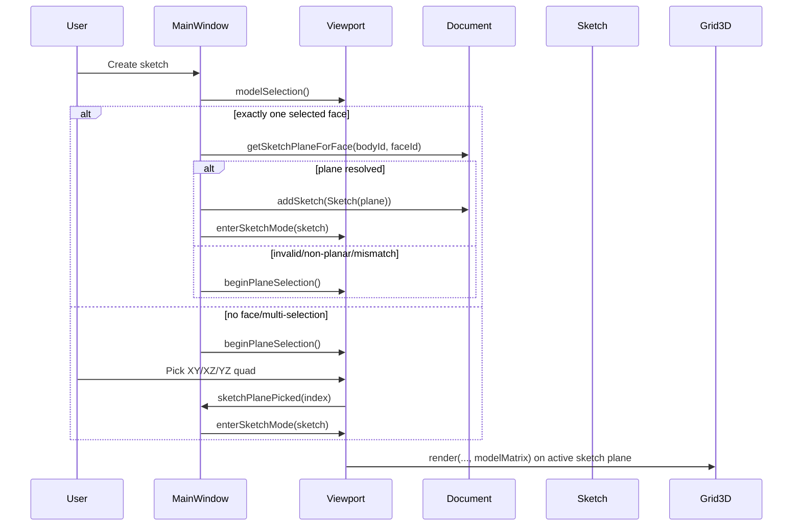

# Sketch on Face and Grid on Working Plane

## Verified current state

- **Create sketch is plane-picker only today**
  - `ContextToolbar::newSketchRequested` -> `MainWindow::onNewSketch()` -> `Viewport::beginPlaneSelection()` -> `Viewport::sketchPlanePicked(int)` -> `MainWindow::onSketchPlanePicked(int)` -> `Document::addSketch(...)` -> `Viewport::enterSketchMode(...)`.
  - References: [MainWindow.cpp](src/ui/mainwindow/MainWindow.cpp), [Viewport.cpp](src/ui/viewport/Viewport.cpp).
- **Important behavior detail to preserve**
  - In [MainWindow::onNewSketch()](src/ui/mainwindow/MainWindow.cpp), if already in sketch mode it calls `onExitSketch()` and then continues (no early return) to start plane selection.
- **Selection data exists but MainWindow cannot read it directly**
  - `Viewport` owns `SelectionManager` and emits only `selectionContextChanged(int)` to MainWindow.
  - MainWindow currently knows context (edge/face/body) but not selected `SelectionItem` IDs.
- **Face pick IDs are suitable**
  - Model picker emits `SelectionKind::Face` with `id.ownerId = bodyId`, `id.elementId = faceId`.
  - Reference: [ModelPickerAdapter.cpp](src/ui/selection/ModelPickerAdapter.cpp).
- **Sketch core is already plane-agnostic**
  - [SketchPlane](src/core/sketch/Sketch.h) and [Sketch](src/core/sketch/Sketch.cpp) already support arbitrary planes.
- **Grid is currently XY-only in world space**
  - Grid geometry is built with `z=0` in [Grid3D.cpp](src/render/Grid3D.cpp).
  - Fade uses XY distance in shader (`vWorldPos.xy`, `uFadeOrigin.xy`) in [Grid3D.cpp](src/render/Grid3D.cpp).
  - Viewport grid bounds use `intersectRayWithPlaneZ0` and `computePlaneBoundsXY` in [Viewport.cpp](src/ui/viewport/Viewport.cpp).

## Review of previous draft (must-fix corrections)

- **Correction 1: `onNewSketch` flow**
  - Prior draft said "exit sketch mode and return". That is incorrect vs current code and would change behavior.
  - Correct: exit sketch mode, then continue create-sketch flow.
- **Correction 2: face frame robustness**
  - Prior draft converted `gp_Pln` directly and only flipped normal on reversed faces.
  - Risk: inconsistent handedness/mirroring if tangent axes are not rebuilt from final normal.
  - Correct: rebuild right-handed orthonormal frame (normal + tangent seed -> x, y = n x x).
- **Correction 3: body/face ownership validation**
  - Prior draft missed explicit proof that selected face belongs to selected body.
  - Correct: validate face containment in selected body before creating sketch.
- **Correction 4: grid fade scope**
  - Prior draft introduced optional 3D fade branch immediately.
  - Correct: phase 1 keeps existing 2D radial fade model in plane-local UV coordinates; add 3D fade only if needed later.

## Architecture (optimized)

- **MainWindow + Viewport**: face-aware create-sketch decision with existing picker fallback.
- **Document**: read-only API `bodyId + faceId -> SketchPlane` (planar face only).
- **Grid + Viewport**: render grid in sketch plane using model matrix; compute bounds/fade in plane UV.

## Implementation plan

### 1) Document face-plane API (app layer)

- Add `std::optional<core::sketch::SketchPlane> Document::getSketchPlaneForFace(const std::string& bodyId, const std::string& faceId) const` in [Document.h](src/app/document/Document.h) and [Document.cpp](src/app/document/Document.cpp).
- Validation sequence (strict, ordered):
  1. `bodyId` and `faceId` are non-empty.
  2. `getBodyShape(bodyId)` exists and not null.
  3. `elementMap().find(ElementId{faceId})` exists, kind is `Face`, shape not null.
  4. Resolved face belongs to selected body (containment check using body's mapped faces).
  5. Face is planar (`BRepAdaptor_Surface(face, true).GetType() == GeomAbs_Plane`).
- Plane conversion sequence (stable orientation):
  1. `gp_Pln plane = surface.Plane()`.
  2. `normal = plane.Axis().Direction()`; reverse if face orientation is `TopAbs_REVERSED`.
  3. `xSeed = plane.Position().XDirection()`.
  4. Remove normal component from `xSeed`, normalize to `xAxis`; if degenerate, choose safe perpendicular fallback.
  5. `yAxis = normal x xAxis` (right-handed).
  6. Build `SketchPlane{origin, xAxis, yAxis, normal}`.
- Scope guard:
  - Keep all OCCT conversion logic in app layer.
  - Do not add OCCT dependencies to `core/sketch`.
- Origin policy for this change:
  - Default now: use plane location for minimal risk.
  - Follow-up option: switch to face bbox center for strict spec alignment.

### 2) Expose model selection from Viewport

- Add `Viewport::modelSelection() const -> std::vector<app::selection::SelectionItem>` in [Viewport.h](src/ui/viewport/Viewport.h) + [Viewport.cpp](src/ui/viewport/Viewport.cpp).
- Return a copy of `m_selectionManager->selection()`.
- No new signal needed.

### 3) MainWindow create-sketch decision flow

- Update [MainWindow::onNewSketch()](src/ui/mainwindow/MainWindow.cpp):
  - Preserve current behavior: if in sketch mode, call `onExitSketch()` and continue.
  - Fetch `selection = m_viewport->modelSelection()`.
  - If exactly one selected item and `kind == Face`:
    - call `m_document->getSketchPlaneForFace(selection[0].id.ownerId, selection[0].id.elementId)`.
    - on success: create sketch, `addSketch`, `getSketch`, `enterSketchMode`, set status/toolbar context, return.
    - on failure: fall through to picker.
  - Fallback unchanged: `beginPlaneSelection()` + status text.
- Keep [MainWindow::onSketchPlanePicked(int)](src/ui/mainwindow/MainWindow.cpp) unchanged for XY/XZ/YZ path.

### 4) Grid rendering on active sketch plane

- Update [Grid3D.h](src/render/Grid3D.h) + [Grid3D.cpp](src/render/Grid3D.cpp):
  - Extend render API with optional `modelMatrix` (default identity).
  - Keep fade origin as 2D plane-local coordinate in phase 1.
  - Vertex shader: use `uMVP = viewProjection * modelMatrix`.
  - Fragment shader: keep existing radial fade formula shape using local UV equivalent.
- Update grid path in [Viewport::paintGL()](src/ui/viewport/Viewport.cpp):
  - Non-sketch mode: keep current Z=0 path untouched.
  - Sketch mode:
    1. Read active sketch plane.
    2. Build model matrix from plane frame using robust orthonormalization (same conventions as existing sketch rendering helpers).
    3. Compute frustum-plane intersections for that plane.
    4. Convert intersection points to plane UV; derive `viewMin/viewMax` in UV.
    5. Project camera position onto plane and convert to UV for fade origin.
    6. Call `m_grid->render(viewProjection, pixelScale, uvMin, uvMax, uvFade, modelMatrix)`.

### 5) Generalized plane helpers in Viewport

- Add new helpers (anonymous namespace in [Viewport.cpp](src/ui/viewport/Viewport.cpp)):
  - `intersectRayWithPlane(...)` for arbitrary plane.
  - `computePlaneBoundsUV(viewProjection, sketchPlane, outBounds)`.
- Keep existing `intersectRayWithPlaneZ0` and `computePlaneBoundsXY` for non-sketch branch.
- Preserve fallback/clamp behavior for near-parallel view cases.

### 6) Edge cases and regression criteria

- Single selected face but non-planar -> fallback to picker.
- Face ID missing from ElementMap -> fallback.
- Face entry exists but not in selected body -> fallback.
- Face ID promoted/grouped by picker but not resolvable -> fallback.
- Enter sketch mode on face -> grid aligns with that plane on first frame.
- Existing XY/XZ/YZ creation still works.
- Non-sketch mode grid still uses world Z=0.

### 7) Verification plan (implementation-time)

- Manual checks:
  - Planar face selected -> direct sketch on face.
  - Non-planar face selected -> picker shown.
  - No selection / multi-selection -> picker shown.
  - Enter/exit sketch repeatedly -> grid/camera stable.
- Build check:
  - `cmake --build build --target test_compile`.
- Optional focused tests:
  - face-to-plane frame orientation sanity (normal + handedness).
  - body/face mismatch rejection.

### 8) Files to touch

| Area                 | Files                                                                                    |
| -------------------- | ---------------------------------------------------------------------------------------- |
| Face-plane API       | [Document.h](src/app/document/Document.h), [Document.cpp](src/app/document/Document.cpp) |
| Selection accessor   | [Viewport.h](src/ui/viewport/Viewport.h), [Viewport.cpp](src/ui/viewport/Viewport.cpp)   |
| Create sketch flow   | [MainWindow.cpp](src/ui/mainwindow/MainWindow.cpp)                                       |
| Grid transform       | [Grid3D.h](src/render/Grid3D.h), [Grid3D.cpp](src/render/Grid3D.cpp)                     |
| Plane bounds helpers | [Viewport.cpp](src/ui/viewport/Viewport.cpp)                                             |

### 9) Explicitly deferred

- Auto-projection of face edges into sketch as construction geometry.
- Persisting support-face reference on sketch entities.
- Shader-level 3D fade branch.
- Changing no-selection behavior to auto-XY (keep current picker UX in this change).

## Summary

- Sketch core remains unchanged.
- Create sketch becomes face-aware when exactly one planar face is selected.
- Safety comes from strict body/face ownership + planar validation before sketch creation.
- Grid renders on active sketch plane in sketch mode, while preserving current world-XY grid path outside sketch mode.

## Unresolved questions

- Should this change include spec-origin alignment (face bbox center), or keep plane location for now?
- On invalid selected face, should UI show explicit warning, or silently fall back to picker?

