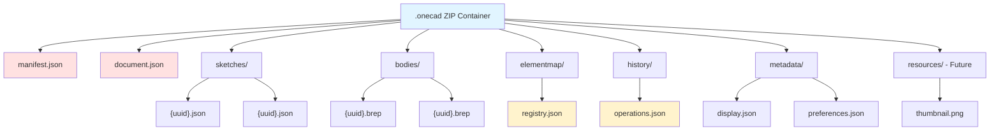
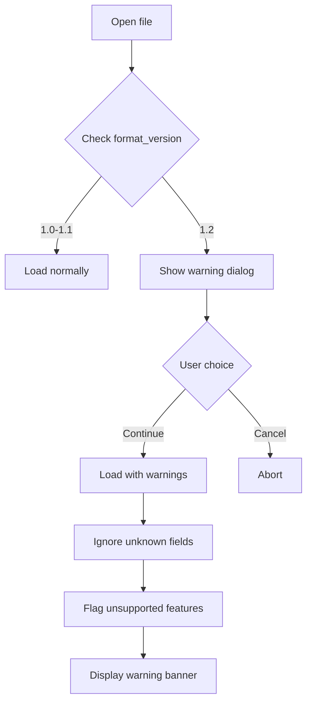
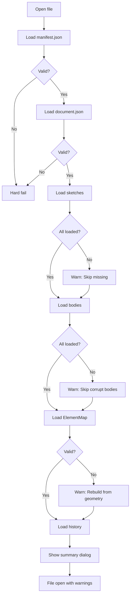
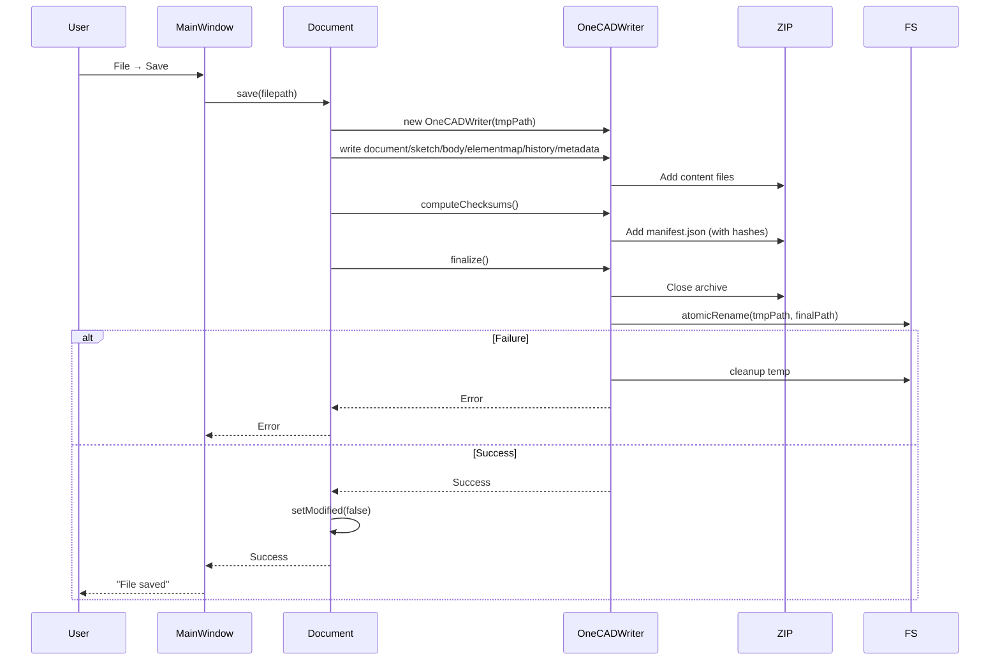
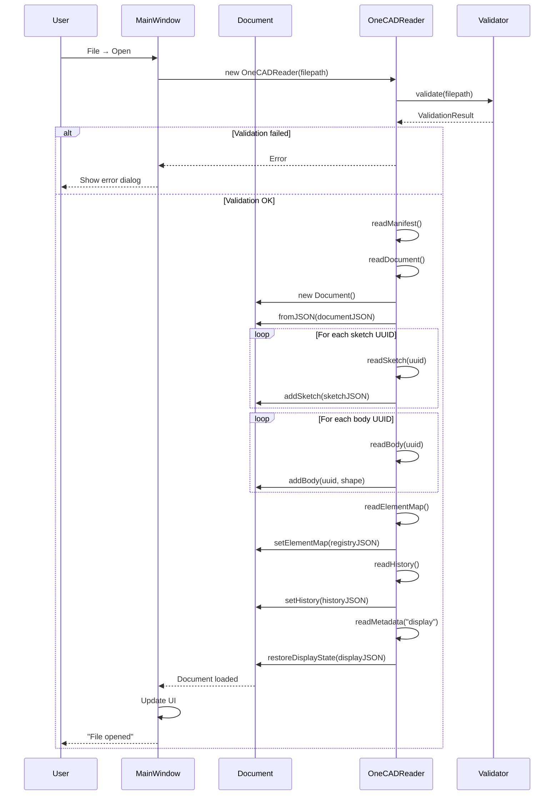
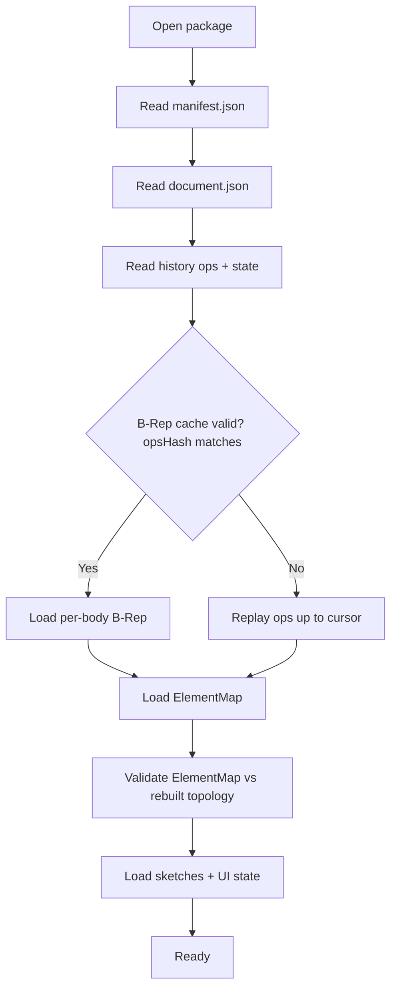

# Claude Analysis


OneCAD Native File Format Specification (.onecad)

**Version:** 1.0  
**Document Date:** 2026-01-09  
**Status:** Implementation-Ready Specification  
**Target:** OneCAD v1.0 (macOS Apple Silicon)

---

## Table of Contents

1. [Executive Summary](#1-executive-summary)
2. [Design Philosophy](#2-design-philosophy)
3. [File Structure Overview](#3-file-structure-overview)
4. [Container Format (ZIP)](#4-container-format-zip)
5. [Manifest Schema](#5-manifest-schema)
6. [Document Schema](#6-document-schema)
7. [Sketch Data Schema](#7-sketch-data-schema)
8. [ElementMap Schema](#8-elementmap-schema)
9. [Feature History Schema](#9-feature-history-schema)
10. [BREP Geometry Storage](#10-brep-geometry-storage)
11. [Metadata & Display State](#11-metadata--display-state)
12. [Extensibility Architecture](#12-extensibility-architecture)
13. [Version Management](#13-version-management)
14. [Error Handling & Recovery](#14-error-handling--recovery)
15. [Implementation Guide](#15-implementation-guide)
16. [File Operations Workflows](#16-file-operations-workflows)
17. [Performance Considerations](#17-performance-considerations)
18. [Appendix](#18-appendix)

---

## 1. Executive Summary

### 1.1 Format Goals

The `.onecad` format is designed to be:

| Priority | Requirement | Implementation |
|----------|-------------|----------------|
| **P0** | Preserve full topological naming (ElementMap) | Complete descriptor + evolution history |
| **P0** | Enable parametric regeneration | Full operation history with dependencies |
| **P0** | Git-friendly & debuggable | JSON + uncompressed ZIP |
| **P1** | Backward compatible | Version migration system |
| **P1** | Recoverable from corruption | Partial loading with warnings |
| **P2** | Extensible for future features | Reserved sections + metadata extensions |

### 1.2 Key Characteristics

```
.onecad File
│
├─ Container:        ZIP (uncompressed for v1.0)
├─ Metadata:         JSON (human-readable)
├─ Geometry:         OCCT BRep (native binary)
├─ Topological IDs:  ElementMap (full history)
├─ Parametric:       Always stored (even for direct modeling)
└─ Size Estimate:    3-15 MB for typical maker projects
```

### 1.3 Format Version Compatibility

| Format Version | OneCAD Version | Compatibility |
|----------------|----------------|---------------|
| 1.0 | v1.0 - v1.3 | Native support |
| 1.1 | v1.4 - v1.6 | Backward compatible with 1.0 |
| 2.0 | v2.0+ | Migration required, with tool support |

---

## 2. Design Philosophy

### 2.1 Core Principles

**1. Human-Readable Where Possible**
```json
// Good: Can diff in Git, debug in text editor
{
  "type": "ExtrudeOperation",
  "distance": 25.0,
  "draft_angle": 5.0
}

// Bad: Binary blob, debugging nightmare
\x4F\x70\x65\x72\x61\x74\x69\x6F\x6E...
```

**2. Binary Where Necessary**
- OCCT BREP: Already optimized, don't reinvent
- Future: Mesh tessellation cache (v2.0+)

**3. Defensive Design**
```cpp
// Every section has schema version + validation
{
  "schema_version": "1.0",
  "checksum": "sha256:abc123...",  // For corruption detection
  "data": { ... }
}
```

**4. Extensibility via Unknown Key Tolerance**
```json
{
  "bodies": [ ... ],
  "future_feature_v2": { ... }  // v1.0 reader ignores unknown keys
}
```

### 2.2 Trade-offs Accepted for v1.0

| Decision | Rationale | Future Optimization |
|----------|-----------|---------------------|
| Uncompressed ZIP | Git-friendly diffs + easy forensic debugging; size trade-off is acceptable within the §3.2 budget for v1.0 | Add gzip in v1.5 with user preference |
| JSON metadata | Human-readable aligns with GitOps/debugging goals and current Qt JSON tooling | Migrate to Protocol Buffers in v2.0 |
| Load all bodies | Simplifies v1.0 load/validation; acceptable for current ~100–500 body target before lazy loading | Lazy loading in v2.0 for 1000+ body models |
| No render cache | Avoids cache invalidation/staleness in v1.0 even if cold loads are slower | Add progressive tessellation cache in v1.3 |

---

## 3. File Structure Overview

### 3.1 Directory Layout

```
example_project.onecad (ZIP archive)
│
├── manifest.json              # File metadata, version, TOC
├── document.json              # Main document structure
│
├── sketches/
│   ├── {sketch-uuid-1}.json   # Sketch geometry + constraints
│   ├── {sketch-uuid-2}.json
│   └── ...
│
├── bodies/
│   ├── {body-uuid-1}.brep     # OCCT BRep binary
│   ├── {body-uuid-2}.brep
│   └── ...
│
├── elementmap/
│   ├── registry.json          # ElementMap evolution history
│   └── descriptors/           # [Future: Split large maps]
│       └── {body-uuid}.json
│
├── history/
│   └── operations.json        # Parametric feature history
│
├── metadata/
│   ├── display.json           # Camera, visibility, custom names
│   ├── preferences.json       # Document-specific settings
│   └── annotations.json       # [Future v1.2] Dimensions, notes
│
├── resources/                 # [Future v1.3]
│   ├── thumbnail.png          # 256x256 preview for Finder
│   ├── materials/             # [Future v2.0]
│   └── textures/              # [Future v2.0]
│
└── templates/                 # [Future v1.4]
    └── template_info.json
```

### 3.2 File Size Budget (v1.0)

| Component | Typical Size | Max Expected |
|-----------|--------------|--------------|
| manifest.json | 2 KB | 10 KB |
| document.json | 10 KB | 50 KB |
| sketches/*.json | 500 KB | 5 MB |
| bodies/*.brep | 2 MB | 20 MB |
| elementmap/*.json | 1 MB | 10 MB |
| history/operations.json | 200 KB | 2 MB |
| metadata/*.json | 50 KB | 200 KB |
| **Total** | **~4 MB** | **~37 MB** |

### 3.3 Visual Structure



---

## 4. Container Format (ZIP)

### 4.1 ZIP Specification

**Requirements:**
- Standard ZIP format (PKZIP compatible)
- **No compression** for v1.0 (store method)
- UTF-8 filenames
- Preserve directory structure
- No encryption (for v1.0)

**Rationale:**
```
Uncompressed ZIP Benefits:
✅ Git can diff internal JSON files
✅ Can extract/inspect with standard tools (unzip, 7-Zip)
✅ Fast write/read (no compression overhead)
✅ Easier debugging during development
❌ Larger file sizes (acceptable for v1.0 maker projects)
```

### 4.2 Implementation (C++ with Qt)

```cpp
// src/io/FileFormat.h
#pragma once
#include <QString>
#include <QJsonDocument>
#include <memory>

namespace onecad::io {

class OneCADWriter {
public:
    explicit OneCADWriter(const QString& filepath);
    ~OneCADWriter();
    
    // Write sections
    bool writeManifest(const QJsonObject& manifest);
    bool writeDocument(const QJsonObject& document);
    bool writeSketch(const QString& uuid, const QJsonObject& sketch);
    bool writeBody(const QString& uuid, const QByteArray& brep);
    bool writeElementMap(const QJsonObject& registry);
    bool writeHistory(const QJsonObject& operations);
    bool writeMetadata(const QString& section, const QJsonObject& data);
    
    // Finalize and close
    bool finalize();
    
private:
    class Impl;
    std::unique_ptr<Impl> pImpl;
};

class OneCADReader {
public:
    explicit OneCADReader(const QString& filepath);
    ~OneCADReader();
    
    // Validation
    bool isValid() const;
    QString errorString() const;
    
    // Read sections
    QJsonObject readManifest();
    QJsonObject readDocument();
    QJsonObject readSketch(const QString& uuid);
    QByteArray readBody(const QString& uuid);
    QJsonObject readElementMap();
    QJsonObject readHistory();
    QJsonObject readMetadata(const QString& section);
    
    // Introspection
    QStringList listSketches() const;
    QStringList listBodies() const;
    
private:
    class Impl;
    std::unique_ptr<Impl> pImpl;
};

} // namespace onecad::io
```

### 4.3 ZIP Creation Pattern

```cpp
// src/io/OneCADWriter.cpp (pseudocode)
#include <QuaZip>  // Or use libzip, or Qt's built-in ZIP (if available)

class OneCADWriter::Impl {
    QuaZip zip;
    QString filepath;
    
public:
    Impl(const QString& path) : filepath(path) {
        zip.setZipName(path);
        zip.open(QuaZip::mdCreate);
    }
    
    bool writeFile(const QString& internalPath, const QByteArray& data) {
        QuaZipFile outFile(&zip);
        QuaZipNewInfo info(internalPath);
        info.setPermissions(QFile::ReadOwner | QFile::WriteOwner);
        
        // Force uncompressed (store method)
        if (!outFile.open(QIODevice::WriteOnly, info, nullptr, 0, Z_NO_COMPRESSION)) {
            return false;
        }
        
        outFile.write(data);
        outFile.close();
        return true;
    }
};
```

---

## 5. Manifest Schema

### 5.1 Purpose

The `manifest.json` is the **entry point** for file validation and version detection.

**Critical Requirements:**
- ✅ Must be first file read (validate before loading large BREP data)
- ✅ Contains format version (enables migration logic)
- ✅ Checksum for corruption detection
- ✅ Table of contents (future lazy loading)

### 5.2 Schema Definition

```json
{
  "$schema": "https://onecad.org/schemas/manifest-v1.0.json",
  
  "format_version": "1.0",
  "schema_version": "1.0",
  "created_with": "OneCAD 1.0.0",
  "created_date": "2026-01-09T14:30:00Z",
  "modified_date": "2026-01-09T16:45:00Z",
  
  "document": {
    "name": "Bracket Assembly",
    "uuid": "550e8400-e29b-41d4-a716-446655440000",
    "description": "Mounting bracket for enclosure",
    "author": "John Maker",
    "units": "mm"
  },
  
  "contents": {
    "sketches": [
      "sketch-uuid-1",
      "sketch-uuid-2"
    ],
    "bodies": [
      "body-uuid-1",
      "body-uuid-2"
    ],
    "operation_count": 12
  },
  
  "integrity": {
    "document_checksum": "sha256:abc123...",
    "elementmap_checksum": "sha256:def456...",
    "validation_timestamp": "2026-01-09T16:45:00Z"
  },
  
  "compatibility": {
    "min_version": "1.0",
    "recommended_version": "1.0",
    "warnings": []
  },
  
  "extensions": {
    "has_thumbnail": false,
    "has_materials": false,
    "has_annotations": false,
    "custom": {}
  }
}
```

### 5.3 Field Reference

| Field | Type | Required | Description |
|-------|------|----------|-------------|
| `format_version` | string | ✅ | File format version (semver) |
| `schema_version` | string | ✅ | JSON schema version |
| `created_with` | string | ✅ | Application name + version |
| `created_date` | ISO8601 | ✅ | File creation timestamp (UTC) |
| `modified_date` | ISO8601 | ✅ | Last modification timestamp |
| `document.name` | string | ✅ | User-visible document name |
| `document.uuid` | UUID | ✅ | Unique document identifier |
| `document.units` | enum | ✅ | `"mm"`, `"cm"`, `"in"`, `"ft"` |
| `contents.sketches` | array | ✅ | List of sketch UUIDs |
| `contents.bodies` | array | ✅ | List of body UUIDs |
| `integrity.document_checksum` | string | ⚠️ | SHA-256 of document.json (v1.1+) |
| `compatibility.min_version` | string | ✅ | Minimum OneCAD version required |
| `extensions` | object | ⚠️ | Future feature flags |

### 5.4 Validation Logic

```cpp
// src/io/ManifestValidator.cpp
namespace onecad::io {

enum class ValidationResult {
    Valid,
    CompatibleWithWarnings,
    Incompatible,
    Corrupted
};

class ManifestValidator {
public:
    ValidationResult validate(const QJsonObject& manifest) {
        // 1. Check required fields
        if (!manifest.contains("format_version") || 
            !manifest.contains("document")) {
            return ValidationResult::Corrupted;
        }
        
        // 2. Version compatibility check
        QString formatVersion = manifest["format_version"].toString();
        if (formatVersion.startsWith("2.")) {
            // Future major version - needs migration
            return ValidationResult::Incompatible;
        }
        
        // 3. Checksum validation (if present)
        if (manifest.contains("integrity")) {
            if (!validateChecksum(manifest["integrity"].toObject())) {
                return ValidationResult::Corrupted;
            }
        }
        
        return ValidationResult::Valid;
    }
    
private:
    bool validateChecksum(const QJsonObject& integrity) {
        // Compare stored checksum with actual document.json hash
        // Implementation in Phase 3.1
        return true;
    }
};

} // namespace
```

---

## 6. Document Schema

### 6.1 Purpose

`document.json` is the **central hub** linking all other components.

### 6.2 Schema Definition

```json
{
  "$schema": "https://onecad.org/schemas/document-v1.0.json",
  "schema_version": "1.0",
  
  "metadata": {
    "uuid": "550e8400-e29b-41d4-a716-446655440000",
    "name": "Bracket Assembly",
    "description": "Mounting bracket with M6 holes",
    "author": "John Maker",
    "created": "2026-01-09T14:30:00Z",
    "modified": "2026-01-09T16:45:00Z",
    "units": "mm"
  },
  
  "sketches": [
    {
      "uuid": "sketch-001",
      "name": "Base Profile",
      "plane": {
        "type": "XY",
        "origin": [0, 0, 0],
        "normal": [0, 0, 1]
      },
      "filepath": "sketches/sketch-001.json"
    },
    {
      "uuid": "sketch-002",
      "name": "Mounting Holes",
      "plane": {
        "type": "OnFace",
        "face_element_id": "Face:abc123...",
        "origin": [10, 20, 5],
        "normal": [0, 0, 1]
      },
      "filepath": "sketches/sketch-002.json"
    }
  ],
  
  "bodies": [
    {
      "uuid": "body-001",
      "name": "Main Bracket",
      "type": "Solid",
      "visible": true,
      "filepath": "bodies/body-001.brep",
      "created_by_operation": "extrude-001"
    },
    {
      "uuid": "body-002",
      "name": "Support Rib",
      "type": "Solid",
      "visible": true,
      "filepath": "bodies/body-002.brep",
      "created_by_operation": "extrude-002"
    }
  ],
  
  "operations": {
    "filepath": "history/operations.json",
    "count": 12,
    "last_operation": "fillet-003"
  },
  
  "elementmap": {
    "filepath": "elementmap/registry.json"
  },
  
  "preferences": {
    "grid_spacing": 10.0,
    "snap_enabled": true,
    "parametric_mode": true
  }
}
```

### 6.3 Body Reference Schema

```json
{
  "uuid": "body-001",
  "name": "Main Bracket",
  "type": "Solid",              // "Solid" | "Sheet" | "Wire"
  "visible": true,
  "color": {                    // Optional custom color
    "r": 128,
    "g": 128,
    "b": 128,
    "a": 255
  },
  "filepath": "bodies/body-001.brep",
  "created_by_operation": "extrude-001",
  "elementmap_version": 42,     // Increments on modification
  "bbox": {                     // Cached bounding box (optional)
    "min": [-50, -50, 0],
    "max": [50, 50, 25]
  }
}
```

### 6.4 Sketch Reference Schema

```json
{
  "uuid": "sketch-001",
  "name": "Base Profile",
  "plane": {
    "type": "XY",               // "XY" | "XZ" | "YZ" | "OnFace" | "Offset"
    "origin": [0, 0, 0],        // World coordinates
    "x_axis": [1, 0, 0],        // Optional: for arbitrary planes
    "y_axis": [0, 1, 0],
    "normal": [0, 0, 1]
  },
  "filepath": "sketches/sketch-001.json",
  "locked": false,              // Prevent modification
  "construction_mode": false,   // Entire sketch as construction
  "projected_edges": [          // References to body edges
    {
      "edge_element_id": "Edge:xyz789...",
      "body_uuid": "body-001"
    }
  ]
}
```

---

## 7. Sketch Data Schema

### 7.1 Individual Sketch File

Each sketch is a **separate JSON file** for Git diff clarity.

**Path:** `sketches/{sketch-uuid}.json`

```json
{
  "$schema": "https://onecad.org/schemas/sketch-v1.0.json",
  "schema_version": "1.0",
  
  "metadata": {
    "uuid": "sketch-001",
    "name": "Base Profile",
    "created": "2026-01-09T14:30:00Z",
    "modified": "2026-01-09T15:15:00Z"
  },
  
  "plane": {
    "type": "XY",
    "origin": [0, 0, 0],
    "x_axis": [1, 0, 0],
    "y_axis": [0, 1, 0],
    "normal": [0, 0, 1]
  },
  
  "entities": {
    "points": [
      {
        "id": "point-001",
        "x": 0.0,
        "y": 0.0,
        "fixed": true,
        "construction": false
      }
    ],
    
    "lines": [
      {
        "id": "line-001",
        "start_point": "point-001",
        "end_point": "point-002",
        "construction": false
      }
    ],
    
    "arcs": [
      {
        "id": "arc-001",
        "center_point": "point-003",
        "start_point": "point-004",
        "end_point": "point-005",
        "radius": 10.0,
        "construction": false
      }
    ],
    
    "circles": [
      {
        "id": "circle-001",
        "center_point": "point-006",
        "radius": 5.0,
        "construction": false
      }
    ],
    
    "ellipses": [
      {
        "id": "ellipse-001",
        "center_point": "point-007",
        "major_radius": 15.0,
        "minor_radius": 10.0,
        "angle": 45.0,
        "construction": false
      }
    ]
  },
  
  "constraints": [
    {
      "id": "constraint-001",
      "type": "Horizontal",
      "entities": ["line-001"]
    },
    {
      "id": "constraint-002",
      "type": "Distance",
      "entities": ["point-001", "point-002"],
      "value": 50.0,
      "driving": true
    },
    {
      "id": "constraint-003",
      "type": "Coincident",
      "entities": ["point-002", "line-002"]
    }
  ],
  
  "faces": [
    {
      "id": "face-001",
      "region_index": 0,
      "outer_loop": ["line-001", "arc-001", "line-002", "line-003"],
      "inner_loops": [
        ["circle-001"]
      ]
    }
  ],
  
  "projected_edges": [
    {
      "id": "projected-001",
      "source_element_id": "Edge:abc123...",
      "source_body_uuid": "body-001",
      "construction": true,
      "entities": ["line-004", "arc-002"]
    }
  ],
  
  "solver_state": {
    "dof": 0,
    "status": "Solved",
    "redundant_constraints": [],
    "conflicting_constraints": []
  }
}
```

### 7.2 Entity Schemas

**Point:**
```json
{
  "id": "point-001",
  "x": 10.5,
  "y": -5.25,
  "fixed": false,
  "construction": false
}
```

**Line:**
```json
{
  "id": "line-001",
  "start_point": "point-001",
  "end_point": "point-002",
  "construction": false
}
```

**Arc:**
```json
{
  "id": "arc-001",
  "center_point": "point-003",
  "start_point": "point-004",
  "end_point": "point-005",
  "radius": 10.0,
  "start_angle": 0.0,       // Optional: radians
  "end_angle": 1.5708,      // Optional: radians (π/2)
  "construction": false
}
```

**Circle:**
```json
{
  "id": "circle-001",
  "center_point": "point-006",
  "radius": 5.0,
  "construction": false
}
```

**Ellipse:**
```json
{
  "id": "ellipse-001",
  "center_point": "point-007",
  "major_radius": 15.0,
  "minor_radius": 10.0,
  "angle": 45.0,            // Degrees, rotation of major axis
  "construction": false
}
```

### 7.3 Constraint Schemas

**Geometric Constraints (no value):**
```json
{
  "id": "constraint-001",
  "type": "Horizontal",     // "Horizontal" | "Vertical" | "Parallel" | 
                            // "Perpendicular" | "Tangent" | "Concentric"
  "entities": ["line-001"]
}

{
  "id": "constraint-002",
  "type": "Coincident",
  "entities": ["point-001", "point-002"]
}
```

**Dimensional Constraints:**
```json
{
  "id": "constraint-003",
  "type": "Distance",
  "entities": ["point-001", "point-002"],
  "value": 50.0,
  "driving": true,          // true = dimension drives geometry
                            // false = reference dimension
  "label_position": {       // Optional: UI hint
    "x": 25.0,
    "y": 10.0
  }
}

{
  "id": "constraint-004",
  "type": "Angle",
  "entities": ["line-001", "line-002"],
  "value": 90.0,            // Degrees
  "driving": true
}

{
  "id": "constraint-005",
  "type": "Radius",
  "entities": ["circle-001"],
  "value": 5.0,
  "driving": true
}
```

### 7.4 Face/Region Schema

```json
{
  "id": "face-001",
  "region_index": 0,        // Index from LoopDetector
  "outer_loop": [
    "line-001",
    "arc-001",
    "line-002",
    "line-003"
  ],
  "inner_loops": [          // Holes
    ["circle-001"],
    ["circle-002"]
  ],
  "area": 125.5,            // Cached from LoopDetector
  "centroid": [10.0, 5.0]   // Cached
}
```

---

## 8. ElementMap Schema

### 8.1 Purpose

The ElementMap is **critical** for topological naming persistence. This section stores:

1. **Descriptors** - Geometry-based IDs for all sub-shapes
2. **Evolution History** - How shapes transform through operations
3. **Parent Tracking** - Source attribution for Modified/Generated shapes

**Path:** `elementmap/registry.json`

### 8.2 Registry Schema

```json
{
  "$schema": "https://onecad.org/schemas/elementmap-v1.0.json",
  "schema_version": "1.0",
  
  "metadata": {
    "created": "2026-01-09T14:30:00Z",
    "last_updated": "2026-01-09T16:45:00Z",
    "total_elements": 342,
    "total_operations": 12
  },
  
  "bodies": [
    {
      "uuid": "body-001",
      "name": "Main Bracket",
      "version": 42,                    // Increments on modification
      "elements": {
        "Face:abc123...": {
          "type": "Face",
          "descriptor": {
            "geometry_hash": "abc123...",
            "surface_type": "Plane",
            "area": 125.5,
            "normal": [0, 0, 1],
            "centroid": [10, 5, 2.5],
            "adjacency": ["Edge:xyz789...", "Edge:def456..."]
          },
          "history": [
            {
              "operation_id": "extrude-001",
              "evolution_type": "Generated",
              "parent_element_ids": ["SketchFace:sketch-001:face-001"]
            }
          ]
        },
        
        "Edge:xyz789...": {
          "type": "Edge",
          "descriptor": {
            "geometry_hash": "xyz789...",
            "curve_type": "Line",
            "length": 50.0,
            "start_vertex": [0, 0, 0],
            "end_vertex": [50, 0, 0],
            "tangent_at_mid": [1, 0, 0],
            "adjacent_faces": ["Face:abc123...", "Face:def456..."]
          },
          "history": [
            {
              "operation_id": "extrude-001",
              "evolution_type": "Generated",
              "parent_element_ids": ["SketchEdge:sketch-001:line-001"]
            }
          ]
        }
      }
    }
  ],
  
  "sketches": [
    {
      "uuid": "sketch-001",
      "name": "Base Profile",
      "elements": {
        "SketchFace:sketch-001:face-001": {
          "type": "SketchFace",
          "sketch_face_id": "face-001",
          "descriptor": {
            "geometry_hash": "sketch001...",
            "area": 125.5,
            "centroid": [10, 5]
          }
        },
        
        "SketchEdge:sketch-001:line-001": {
          "type": "SketchEdge",
          "sketch_entity_id": "line-001",
          "descriptor": {
            "geometry_hash": "line001...",
            "length": 50.0,
            "start": [0, 0],
            "end": [50, 0]
          }
        }
      }
    }
  ],
  
  "resolution_hints": {
    "version": 1,
    "fallback_strategies": ["NearestGeometry", "ByIndex"]
  }
}
```

### 8.3 Descriptor Schema (Detailed)

```json
{
  "type": "Face",
  "descriptor": {
    // Core identification
    "geometry_hash": "fnv1a_64bit_hash",
    
    // Geometric properties (quantized)
    "surface_type": "Plane",        // "Plane" | "Cylinder" | "Cone" | "Sphere" | "BSpline"
    "area": 125.5,                  // Quantized to 0.01 precision
    "centroid": [10.0, 5.0, 2.5],   // Quantized to 0.01
    "normal": [0, 0, 1],            // Quantized to 0.001
    
    // Topological context
    "adjacency": [
      "Edge:xyz789...",
      "Edge:def456...",
      "Edge:ghi012..."
    ],
    "vertex_count": 4,
    
    // For Plane surfaces
    "plane_params": {
      "origin": [0, 0, 0],
      "normal": [0, 0, 1]
    },
    
    // For Cylinder surfaces
    "cylinder_params": {
      "axis": [0, 0, 1],
      "radius": 10.0,
      "height": 25.0
    }
  },
  
  "history": [
    {
      "operation_id": "extrude-001",
      "evolution_type": "Generated",    // "Generated" | "Modified" | "Deleted"
      "parent_element_ids": [
        "SketchFace:sketch-001:face-001"
      ],
      "timestamp": "2026-01-09T15:00:00Z"
    },
    {
      "operation_id": "fillet-002",
      "evolution_type": "Modified",
      "parent_element_ids": [
        "Face:abc123..."
      ],
      "timestamp": "2026-01-09T15:30:00Z"
    }
  ]
}
```

### 8.4 Evolution Types

| Type | Description | Example |
|------|-------------|---------|
| **Generated** | New shape created from parent | Extrude face from sketch region |
| **Modified** | Existing shape geometrically altered | Face after fillet operation |
| **Deleted** | Shape removed from topology | Face removed by boolean cut |
| **Split** | One shape becomes multiple | Edge split by intersection |
| **Merged** | Multiple shapes become one | Faces merged by boolean union |

### 8.5 Implementation Pattern

```cpp
// src/kernel/elementmap/ElementMapSerialization.h
namespace onecad::kernel {

struct ElementDescriptorJSON {
    QString elementId;
    QString type;  // "Face", "Edge", "Vertex"
    QJsonObject descriptor;
    QJsonArray history;
    
    static ElementDescriptorJSON fromElementMap(
        const ElementMap& map,
        const ElementId& id
    );
    
    static void toElementMap(
        ElementMap& map,
        const ElementDescriptorJSON& json
    );
};

class ElementMapSerializer {
public:
    // Serialize entire ElementMap for a body
    static QJsonObject serialize(const ElementMap& map);
    
    // Deserialize and rebuild ElementMap
    static ElementMap deserialize(const QJsonObject& json);
    
    // Partial updates (for incremental saves - future)
    static QJsonObject serializeDelta(
        const ElementMap& oldMap,
        const ElementMap& newMap
    );
};

} // namespace
```

---

## 9. Feature History Schema

### 9.1 Purpose

Stores the **parametric operation sequence** for regeneration.

**Path:** `history/operations.json`

### 9.2 Schema Definition

```json
{
  "$schema": "https://onecad.org/schemas/history-v1.0.json",
  "schema_version": "1.0",
  
  "metadata": {
    "operation_count": 12,
    "last_operation_id": "fillet-003",
    "created": "2026-01-09T14:30:00Z",
    "last_modified": "2026-01-09T16:45:00Z"
  },
  
  "operations": [
    {
      "id": "extrude-001",
      "type": "Extrude",
      "timestamp": "2026-01-09T14:35:00Z",
      "enabled": true,
      
      "inputs": {
        "sketch_uuid": "sketch-001",
        "face_ids": ["face-001"]
      },
      
      "parameters": {
        "distance": 25.0,
        "direction": [0, 0, 1],
        "draft_angle": 0.0,
        "boolean_mode": "NewBody"     // "NewBody" | "Add" | "Cut" | "Intersect"
      },
      
      "outputs": {
        "body_uuid": "body-001",
        "created_elements": [
          "Face:abc123...",
          "Edge:xyz789..."
        ]
      },
      
      "dependencies": {
        "sketches": ["sketch-001"],
        "bodies": [],
        "operations": []
      }
    },
    
    {
      "id": "extrude-002",
      "type": "Extrude",
      "timestamp": "2026-01-09T14:45:00Z",
      "enabled": true,
      
      "inputs": {
        "sketch_uuid": "sketch-002",
        "face_ids": ["face-001"]
      },
      
      "parameters": {
        "distance": 10.0,
        "direction": [0, 0, 1],
        "draft_angle": 5.0,
        "boolean_mode": "Add",
        "target_body_uuid": "body-001"
      },
      
      "outputs": {
        "body_uuid": "body-001",       // Modified existing
        "modified_elements": [
          "Face:def456..."
        ],
        "created_elements": [
          "Face:ghi789..."
        ]
      },
      
      "dependencies": {
        "sketches": ["sketch-002"],
        "bodies": ["body-001"],
        "operations": ["extrude-001"]
      }
    },
    
    {
      "id": "fillet-001",
      "type": "Fillet",
      "timestamp": "2026-01-09T15:00:00Z",
      "enabled": true,
      
      "inputs": {
        "body_uuid": "body-001",
        "edge_ids": [
          "Edge:xyz789...",
          "Edge:abc123..."
        ]
      },
      
      "parameters": {
        "radius": 2.0,
        "variable_radii": false       // Future: per-edge radii
      },
      
      "outputs": {
        "body_uuid": "body-001",
        "modified_elements": [
          "Face:abc123...",
          "Face:def456..."
        ],
        "created_elements": [
          "Face:fillet-001-new..."
        ],
        "deleted_elements": []
      },
      
      "dependencies": {
        "bodies": ["body-001"],
        "operations": ["extrude-001", "extrude-002"]
      }
    },
    
    {
      "id": "boolean-001",
      "type": "Boolean",
      "timestamp": "2026-01-09T15:30:00Z",
      "enabled": true,
      
      "inputs": {
        "body_a_uuid": "body-001",
        "body_b_uuid": "body-002"
      },
      
      "parameters": {
        "operation": "Union",         // "Union" | "Subtract" | "Intersect"
        "keep_originals": false
      },
      
      "outputs": {
        "result_body_uuid": "body-001",
        "deleted_bodies": ["body-002"],
        "modified_elements": [ "..." ],
        "created_elements": [ "..." ]
      },
      
      "dependencies": {
        "bodies": ["body-001", "body-002"],
        "operations": ["extrude-001", "extrude-002"]
      }
    }
  ],
  
  "dependency_graph": {
    "nodes": [
      "sketch-001",
      "sketch-002",
      "extrude-001",
      "extrude-002",
      "fillet-001",
      "boolean-001"
    ],
    "edges": [
      ["sketch-001", "extrude-001"],
      ["sketch-002", "extrude-002"],
      ["extrude-001", "fillet-001"],
      ["extrude-002", "fillet-001"],
      ["fillet-001", "boolean-001"]
    ]
  }
}
```

### 9.3 Operation Type Reference

| Operation Type | Required Inputs | Key Parameters |
|----------------|-----------------|----------------|
| **Extrude** | sketch_uuid, face_ids | distance, direction, draft_angle, boolean_mode |
| **Revolve** | sketch_uuid, face_ids, axis | angle, axis_origin, axis_direction |
| **Fillet** | body_uuid, edge_ids | radius, variable_radii (future) |
| **Chamfer** | body_uuid, edge_ids | distance, angle |
| **Shell** | body_uuid, face_ids | thickness, direction (inward/outward) |
| **Boolean** | body_a_uuid, body_b_uuid | operation (Union/Subtract/Intersect) |
| **LinearPattern** | source_operation_id | count, direction, spacing |
| **CircularPattern** | source_operation_id | count, axis, angle |

### 9.4 Dependency Graph

**Purpose:** Enable:
- ✅ Correct regeneration order
- ✅ Cascading updates (sketch edit → regenerate all dependent features)
- ✅ Feature suppression (skip operation and all dependents)

```cpp
// src/app/history/DependencyGraph.h
namespace onecad::app {

class DependencyGraph {
public:
    // Build from operations.json
    static DependencyGraph fromJSON(const QJsonObject& history);
    
    // Query
    QStringList getTopologicalOrder() const;
    QStringList getDependents(const QString& nodeId) const;
    QStringList getDependencies(const QString& nodeId) const;
    
    // Validation
    bool hasCycle() const;
    QString findBrokenDependency() const;  // Returns first missing node
    
private:
    QMap<QString, QStringList> adjacency;
};

} // namespace
```

---

## 10. BREP Geometry Storage

### 10.1 OCCT Native Format

**Path:** `bodies/{body-uuid}.brep`

**Format:** OCCT's native `BRepTools::Write()` output (binary)

**Rationale:**
- ✅ Industry-standard, battle-tested
- ✅ Full fidelity (no geometry loss)
- ✅ OCCT handles versioning
- ✅ No custom serialization needed

### 10.2 Write Implementation

```cpp
// src/io/BRepIO.cpp
#include <BRepTools.hxx>
#include <TopoDS_Shape.hxx>
#include <QFile>

namespace onecad::io {

class BRepIO {
public:
    // Write OCCT shape to .brep file
    static bool writeShape(
        const QString& filepath,
        const TopoDS_Shape& shape
    ) {
        std::ofstream file(filepath.toStdString(), std::ios::binary);
        if (!file.is_open()) {
            return false;
        }
        
        BRepTools::Write(shape, file);
        file.close();
        return true;
    }
    
    // Read OCCT shape from .brep file
    static TopoDS_Shape readShape(
        const QString& filepath,
        QString& errorString
    ) {
        TopoDS_Shape shape;
        std::ifstream file(filepath.toStdString(), std::ios::binary);
        
        if (!file.is_open()) {
            errorString = "Cannot open file: " + filepath;
            return shape;
        }
        
        BRep_Builder builder;
        BRepTools::Read(shape, file, builder);
        file.close();
        
        if (shape.IsNull()) {
            errorString = "Failed to read BREP shape from: " + filepath;
        }
        
        return shape;
    }
};

} // namespace
```

### 10.3 Integration with ZIP Writer

```cpp
// In OneCADWriter::writeBody()
bool OneCADWriter::writeBody(const QString& uuid, const TopoDS_Shape& shape) {
    // 1. Write BREP to temporary file
    QString tempPath = QDir::temp().filePath(uuid + ".brep");
    if (!BRepIO::writeShape(tempPath, shape)) {
        return false;
    }
    
    // 2. Read as QByteArray
    QFile tempFile(tempPath);
    tempFile.open(QIODevice::ReadOnly);
    QByteArray brepData = tempFile.readAll();
    tempFile.close();
    
    // 3. Write to ZIP
    QString internalPath = "bodies/" + uuid + ".brep";
    bool success = pImpl->writeFile(internalPath, brepData);
    
    // 4. Cleanup temp file
    QFile::remove(tempPath);
    
    return success;
}
```

---

## 11. Metadata & Display State

### 11.1 Display State

**Path:** `metadata/display.json`

**Purpose:** Preserve viewport and visualization settings.

```json
{
  "$schema": "https://onecad.org/schemas/display-v1.0.json",
  "schema_version": "1.0",
  
  "camera": {
    "position": [100, 100, 100],
    "target": [0, 0, 0],
    "up_vector": [0, 0, 1],
    "fov": 45.0,
    "near_plane": 0.1,
    "far_plane": 10000.0,
    "projection": "Perspective"      // "Perspective" | "Orthographic"
  },
  
  "visibility": {
    "bodies": {
      "body-001": true,
      "body-002": false
    },
    "sketches": {
      "sketch-001": true,
      "sketch-002": false
    },
    "construction_geometry": true,
    "grid": true,
    "axes": true
  },
  
  "custom_names": {
    "body-001": "Main Bracket",
    "sketch-001": "Base Profile"
  },
  
  "selection": {
    "active_bodies": ["body-001"],
    "active_sketches": []
  },
  
  "render_settings": {
    "display_mode": "ShadedWithEdges",  // "Shaded" | "ShadedWithEdges" | "Wireframe"
    "edge_width": 1.0,
    "ambient_occlusion": false,
    "shadows": false
  }
}
```

### 11.2 Preferences

**Path:** `metadata/preferences.json`

**Purpose:** Document-specific settings (override global preferences).

```json
{
  "$schema": "https://onecad.org/schemas/preferences-v1.0.json",
  "schema_version": "1.0",
  
  "units": {
    "linear": "mm",
    "angular": "degrees"
  },
  
  "grid": {
    "spacing": 10.0,
    "subdivisions": 10,
    "adaptive": true
  },
  
  "sketch": {
    "snap_enabled": true,
    "snap_radius": 2.0,
    "auto_constrain": true,
    "show_constraints": true,
    "show_dimensions": true
  },
  
  "modeling": {
    "parametric_mode": true,
    "auto_boolean": true,
    "fillet_preview": true
  },
  
  "export": {
    "last_format": "STEP",
    "step_schema": "AP214"
  }
}
```

### 11.3 Annotations (Future v1.2)

**Path:** `metadata/annotations.json`

```json
{
  "$schema": "https://onecad.org/schemas/annotations-v1.0.json",
  "schema_version": "1.0",
  
  "dimensions": [
    {
      "id": "dim-001",
      "type": "Linear",
      "entity_ids": ["Edge:xyz789..."],
      "value": 50.0,
      "position": [25, 10, 0],
      "text": "50 mm"
    }
  ],
  
  "notes": [
    {
      "id": "note-001",
      "text": "M6 threaded hole",
      "position": [10, 20, 5],
      "leader_target": "Face:abc123..."
    }
  ],
  
  "markup": [
    {
      "id": "markup-001",
      "type": "Arrow",
      "start": [0, 0, 0],
      "end": [10, 10, 10],
      "color": "#FF0000"
    }
  ]
}
```

---

## 12. Extensibility Architecture

### 12.1 Future Resource Support

**Path:** `resources/`

**Structure:**
```
resources/
├── thumbnail.png          # 256x256 preview (v1.3)
├── thumbnail@2x.png       # 512x512 Retina (v1.3)
├── materials/             # v2.0
│   ├── aluminum.json
│   └── plastic_abs.json
├── textures/              # v2.0
│   ├── wood_grain.png
│   └── brushed_metal.png
└── images/                # v1.4 (external image references)
    └── reference_photo.jpg
```

### 12.2 Thumbnail Generation (v1.3 Planned)

```cpp
// src/io/ThumbnailGenerator.h
namespace onecad::io {

class ThumbnailGenerator {
public:
    // Render current viewport to thumbnail
    static QImage generateThumbnail(
        const Viewport* viewport,
        const QSize& size = QSize(256, 256)
    );
    
    // Save PNG to ZIP
    static bool writeThumbnail(
        OneCADWriter& writer,
        const QImage& thumbnail
    );
};

} // namespace
```

**Thumbnail Spec:**
- Format: PNG (8-bit RGB, no alpha)
- Size: 256x256 (standard), 512x512 (Retina)
- Content: Isometric view of entire model
- Background: White (#FFFFFF)

### 12.3 Material Schema (Future v2.0)

```json
{
  "id": "material-001",
  "name": "Aluminum 6061",
  "category": "Metal",
  
  "appearance": {
    "color": [192, 192, 192],
    "metallic": 0.8,
    "roughness": 0.3,
    "texture": "resources/textures/brushed_metal.png"
  },
  
  "physical": {
    "density": 2700.0,           // kg/m³
    "elastic_modulus": 69000.0,  // MPa
    "poisson_ratio": 0.33,
    "thermal_conductivity": 167.0
  }
}
```

### 12.4 External References (Future v1.4)

```json
{
  "external_refs": [
    {
      "id": "ref-001",
      "type": "Image",
      "internal_path": "resources/images/reference_photo.jpg",
      "original_path": "/Users/john/Desktop/photo.jpg",
      "embedded": true
    },
    {
      "id": "ref-002",
      "type": "LinkedModel",
      "internal_path": null,
      "original_path": "/Users/john/Projects/enclosure.onecad",
      "embedded": false,
      "last_modified": "2026-01-09T16:45:00Z"
    }
  ]
}
```

### 12.5 Template Support (Future v1.4)

**Path:** `templates/template_info.json`

```json
{
  "is_template": true,
  "template_name": "Mounting Bracket",
  "template_description": "Standard 80x80mm mounting bracket with M6 holes",
  "category": "Mechanical",
  "tags": ["bracket", "mounting", "hardware"],
  
  "parameters": [
    {
      "id": "param-width",
      "name": "Bracket Width",
      "type": "Length",
      "default_value": 80.0,
      "min_value": 50.0,
      "max_value": 200.0
    },
    {
      "id": "param-hole-size",
      "name": "Hole Diameter",
      "type": "Length",
      "default_value": 6.0,
      "allowed_values": [4.0, 5.0, 6.0, 8.0]
    }
  ]
}
```

---

## 13. Version Management

### 13.1 Semantic Versioning

**Format:** `MAJOR.MINOR` (simplified for file format)

| Version | Breaking Change? | Migration Required? |
|---------|------------------|---------------------|
| 1.0 → 1.1 | No | Automatic (backward compatible) |
| 1.x → 2.0 | Yes | Explicit migration tool |

### 13.2 Compatibility Matrix

| File Format | OneCAD Versions | Load Behavior |
|-------------|-----------------|---------------|
| 1.0 | v1.0 - v1.9 | Native |
| 1.1 | v1.4+ | Native (ignores new v1.1 fields) |
| 1.2 | v1.6+ | Native |
| 2.0 | v2.0+ | Native (v1.x prompts migration) |

### 13.3 Migration Strategy

**Scenario:** User opens v1.2 file in OneCAD v1.0



**Warning Dialog:**
```
⚠️ This file was created with OneCAD v1.6

Some features may not be available in v1.0:
• Annotations (requires v1.2+)
• Template parameters (requires v1.4+)

The file will load, but these features will be hidden.
Consider upgrading to OneCAD v1.6 for full support.

[Continue] [Cancel]
```

### 13.4 ElementMap Descriptor Migration

ElementMap descriptors are stability-critical for topological naming. Use
`elementmap/registry.json.schema_version` to decide upgrade behavior.

**Rules:**
- **Minor schema changes (1.x → 1.y):** auto-upgrade descriptors by mapping or adding fields.
- **Unknown descriptor types:** fall back to `resolution_hints.fallback_strategies` (e.g., `NearestGeometry`, `ByIndex`) and emit warnings.
- **Missing/malformed descriptor fields:** fail the entry load; keep the file loadable with a warning and rebuild the ElementMap from geometry/history when possible.

**Validation hooks:**
- Verify descriptor keys (`shapeType`, `surfaceType`, `curveType`, `center`, `size`, `magnitude`) exist and are well-formed.
- If validation fails, report the entry and action taken (skip, rebuild, or abort).

### 13.5 Version Migration Tool (v2.0+)

```cpp
// src/io/FormatMigration.h
namespace onecad::io {

class FormatMigrator {
public:
    // Check if migration is needed
    static bool needsMigration(const QString& filepath);
    
    // Migrate file to current format version
    static bool migrate(
        const QString& inputPath,
        const QString& outputPath,
        QStringList& migrationLog
    );
    
    // Validate migrated file
    static bool validateMigration(const QString& filepath);
};

} // namespace
```

---

## 14. Error Handling & Recovery

### 14.1 Validation Levels

```cpp
// src/io/Validation.h
namespace onecad::io {

enum class ValidationLevel {
    Strict,      // Reject any inconsistency
    Lenient,     // Warn but continue
    Recover      // Attempt automatic repair
};

struct ValidationResult {
    bool success;
    QStringList errors;
    QStringList warnings;
    QStringList recoveredItems;
};

class FileValidator {
public:
    ValidationResult validate(
        const QString& filepath,
        ValidationLevel level = ValidationLevel::Lenient
    );
    
private:
    bool validateManifest(const QJsonObject& manifest);
    bool validateDocument(const QJsonObject& document);
    bool validateSketch(const QJsonObject& sketch);
    bool validateElementMap(const QJsonObject& elementMap);
    bool validateHistory(const QJsonObject& history);
};

} // namespace
```

### 14.2 Common Error Scenarios

| Error | Detection | Recovery Strategy |
|-------|-----------|-------------------|
| **Missing manifest.json** | File open | Hard fail - corrupt file |
| **Invalid JSON syntax** | JSON parse | Hard fail - show line number |
| **Missing BREP file** | Body load | Warn, skip body, continue |
| **Broken ElementMap reference** | ElementMap load | Warn, rebuild from geometry |
| **Circular dependency** | History parse | Hard fail - invalid history |
| **Unknown operation type** | History parse | Warn, skip operation |
| **Checksum mismatch** | Integrity check | Warn, continue (v1.1+) |

### 14.3 Partial Recovery Flow



### 14.4 Recovery Dialog

```
⚠️ File Loaded with Warnings

The following issues were detected:

Bodies:
  ✅ Loaded: 4
  ⚠️ Skipped: 1 (body-003.brep missing)

Sketches:
  ✅ Loaded: 6
  ❌ Failed: 1 (sketch-005.json - invalid JSON)

History:
  ✅ Loaded: 10 operations
  ⚠️ Skipped: 2 (unknown operation type: "AdvancedLoft")

Recommendation: Save file to repair structure.

[Save Repaired File] [Continue Anyway] [Cancel]
```

---

## 15. Implementation Guide

### 15.1 Phase 3.1 Implementation Plan

**Goal:** Implement `.onecad` save/load for v1.0 with staged checkpoints.

**Estimated LOC (revised):** ~2,800–3,600 lines

#### Phase 3.1a — Container + Manifest + Document (foundation)

| Component | Files | LOC | Priority |
|-----------|-------|-----|----------|
| ZIP I/O | `FileFormat.h/cpp` | 250 | P0 |
| Manifest serialization | `ManifestIO.h/cpp` | 200 | P0 |
| Document serialization | `DocumentIO.h/cpp` | 350 | P0 |
| Validation (manifest/doc) | `Validation.h/cpp` | 150 | P0 |

#### Phase 3.1b — Geometry + Sketch I/O

| Component | Files | LOC | Priority |
|-----------|-------|-----|----------|
| Sketch serialization | `SketchIO.h/cpp` | 300 | P0 |
| BREP I/O + validation | `BRepIO.h/cpp` | 300 | P0 |
| Geometry validation | `Validation.h/cpp` | 150 | P1 |

#### Phase 3.1c — ElementMap + History

| Component | Files | LOC | Priority |
|-----------|-------|-----|----------|
| ElementMap serialization + resolution | `ElementMapIO.h/cpp` | 400 | P0 |
| History serialization | `HistoryIO.h/cpp` | 300 | P0 |
| ElementMap validation | `Validation.h/cpp` | 150 | P1 |

#### Phase 3.1d — Regeneration + dependency graph

| Component | Files | LOC | Priority |
|-----------|-------|-----|----------|
| Regeneration/replay engine | `RegenerationEngine.h/cpp` | 500 | P0 |
| Dependency graph | `DependencyGraph.h/cpp` | 300 | P0 |
| Integration tests | `tests/prototypes/*` | 300 | P0 |

Regeneration + dependency graph work are prerequisites before full save/load validation.

### 15.2 Class Architecture

```cpp
// src/io/FileFormat.h
namespace onecad::io {

// High-level save/load interface
class OneCADFileIO {
public:
    // Save entire document
    static bool saveDocument(
        const QString& filepath,
        const app::Document* document
    );
    
    // Load entire document
    static app::Document* loadDocument(
        const QString& filepath,
        QString& errorString
    );
    
    // Autosave (in-place)
    static bool autosave(
        const QString& filepath,
        const app::Document* document
    );
};

// Granular writer (internal)
class OneCADWriter {
public:
    explicit OneCADWriter(const QString& filepath);
    ~OneCADWriter();
    
    bool writeManifest(const QJsonObject& manifest);
    bool writeDocument(const QJsonObject& document);
    bool writeSketch(const QString& uuid, const QJsonObject& sketch);
    bool writeBody(const QString& uuid, const TopoDS_Shape& shape);
    bool writeElementMap(const QJsonObject& registry);
    bool writeHistory(const QJsonObject& operations);
    bool writeMetadata(const QString& section, const QJsonObject& data);
    
    bool finalize();
    
private:
    class Impl;
    std::unique_ptr<Impl> pImpl;
};

// Granular reader (internal)
class OneCADReader {
public:
    explicit OneCADReader(const QString& filepath);
    ~OneCADReader();
    
    bool isValid() const;
    QString errorString() const;
    
    QJsonObject readManifest();
    QJsonObject readDocument();
    QJsonObject readSketch(const QString& uuid);
    TopoDS_Shape readBody(const QString& uuid);
    QJsonObject readElementMap();
    QJsonObject readHistory();
    QJsonObject readMetadata(const QString& section);
    
    QStringList listSketches() const;
    QStringList listBodies() const;
    
private:
    class Impl;
    std::unique_ptr<Impl> pImpl;
};

} // namespace
```

### 15.3 Serialization Utilities

```cpp
// src/io/JSONUtilities.h
namespace onecad::io {

class JSONUtilities {
public:
    // Vector serialization
    static QJsonArray toJSON(const Eigen::Vector3d& vec);
    static Eigen::Vector3d vectorFromJSON(const QJsonArray& arr);
    
    // UUID generation
    static QString generateUUID();
    
    // Timestamp
    static QString currentTimestamp();  // ISO 8601 UTC
    
    // Checksum
    static QString computeSHA256(const QJsonObject& obj);
    
    // Validation
    static bool validateUUID(const QString& uuid);
    static bool validateTimestamp(const QString& timestamp);
};

} // namespace
```

### 15.4 Integration with Document Class

Document remains an in-memory model; file I/O is handled by `DocumentIO` / `OneCADFileIO`.
Serialization should make error handling and package context explicit to avoid ambiguity.

**Contract:**
- Document serialization is JSON-only (no filesystem paths).
- `DocumentIO` owns package context for resolving `sketches/` and `bodies/` references.
- Errors are returned via `bool`/`std::unique_ptr` + `QString&` (no exceptions in v1.0).
- Document owns sketches, bodies, and ElementMap; ElementMap loads before history replay so regeneration can rebind shapes.
- Load/save are blocking in v1.0; UI should run them off the main thread when needed.

```cpp
// src/app/document/Document.h (serialization contract)
namespace onecad::app {

class Document : public QObject {
    Q_OBJECT
public:
    std::string toJson() const;
    static std::unique_ptr<Document> fromJson(const std::string& json,
                                              QObject* parent = nullptr,
                                              QString* errorMessage = nullptr);

    bool isModified() const;
    void setModified(bool flag);
};

} // namespace onecad::app

// src/io/DocumentIO.h
namespace onecad::io {

class DocumentIO {
public:
    static bool saveDocument(Package* package,
                             const app::Document* document,
                             QString& errorMessage);
    static std::unique_ptr<app::Document> loadDocument(Package* package,
                                                       QObject* parent,
                                                       QString& errorMessage);
};

} // namespace onecad::io
```

---

## 16. File Operations Workflows

### 16.1 Save Workflow



**Atomicity guarantees:**
1. Always write to a temporary package path.
2. Compute checksums from the final content before writing `manifest.json`.
3. Only set `modified = false` after an atomic rename succeeds.
4. On failure, keep the document dirty and clean up temporary files.

### 16.2 Load Workflow



### 16.3 Autosave Workflow

```cpp
// src/app/document/Document.cpp
void Document::setupAutosave() {
    autosaveTimer = new QTimer(this);
    connect(autosaveTimer, &QTimer::timeout, this, &Document::performAutosave);
    autosaveTimer->start(5 * 60 * 1000);  // 5 minutes
}

void Document::performAutosave() {
    if (!isModified()) {
        return;  // No changes to save
    }
    
    QString autosavePath = getAutosavePath();
    
    // Save to temporary location
    if (io::OneCADFileIO::saveDocument(autosavePath, this)) {
        qDebug() << "Autosave successful:" << autosavePath;
    } else {
        qWarning() << "Autosave failed";
    }
}

QString Document::getAutosavePath() const {
    QDir autosaveDir(
        QStandardPaths::writableLocation(QStandardPaths::AppDataLocation) 
        + "/Autosave"
    );
    autosaveDir.mkpath(".");
    
    QString filename = documentName + "-" 
        + QDateTime::currentDateTime().toString("yyyyMMdd-HHmmss")
        + ".autosave";
    
    return autosaveDir.filePath(filename);
}
```

---

## 17. Performance Considerations

### 17.1 Target Performance (v1.0)

| Operation | Target | Acceptable |
|-----------|--------|------------|
| Save 10 bodies | < 2 seconds | < 5 seconds |
| Load 10 bodies | < 3 seconds | < 7 seconds |
| Autosave (incremental) | < 1 second | < 3 seconds |
| Open 100 MB file | < 10 seconds | < 20 seconds |

### 17.2 Optimization Strategies (Future)

**v1.3: Compression**
```cpp
// Add gzip compression to ZIP
QuaZipNewInfo info(internalPath);
info.setPermissions(QFile::ReadOwner | QFile::WriteOwner);

// Use Deflate compression (level 6 = balanced)
outFile.open(QIODevice::WriteOnly, info, nullptr, 0, Z_DEFLATED, 6);
```

**v1.5: Lazy Loading**
```cpp
// Load manifest + document, defer body loading
class LazyBodyLoader {
public:
    TopoDS_Shape getBody(const QString& uuid) {
        if (!loadedBodies.contains(uuid)) {
            loadedBodies[uuid] = reader.readBody(uuid);
        }
        return loadedBodies[uuid];
    }
    
private:
    QMap<QString, TopoDS_Shape> loadedBodies;
};
```

**v2.0: Binary Metadata**
```cpp
// Migrate from JSON to Protocol Buffers
// Expected 3-5x smaller file size, 2-3x faster parsing
```

### 17.3 Memory Usage

| Component | Typical | Max Expected |
|-----------|---------|--------------|
| In-memory Document | 50 MB | 200 MB |
| Tessellation cache | 20 MB | 100 MB |
| Undo stack | 100 MB | 500 MB |
| Total RAM usage | 200 MB | 1 GB |

---

## 18. Appendix

### 18.1 File Extension Registration (macOS)

**Info.plist Configuration:**

```xml
<key>CFBundleDocumentTypes</key>
<array>
    <dict>
        <key>CFBundleTypeExtensions</key>
        <array>
            <string>onecad</string>
        </array>
        <key>CFBundleTypeIconFile</key>
        <string>DocumentIcon</string>
        <key>CFBundleTypeName</key>
        <string>OneCAD Document</string>
        <key>CFBundleTypeRole</key>
        <string>Editor</string>
        <key>LSHandlerRank</key>
        <string>Owner</string>
        <key>LSItemContentTypes</key>
        <array>
            <string>com.onecad.document</string>
        </array>
    </dict>
</array>

<key>UTExportedTypeDeclarations</key>
<array>
    <dict>
        <key>UTTypeConformsTo</key>
        <array>
            <string>public.data</string>
            <string>public.composite-content</string>
        </array>
        <key>UTTypeDescription</key>
        <string>OneCAD Document</string>
        <key>UTTypeIconFile</key>
        <string>DocumentIcon</string>
        <key>UTTypeIdentifier</key>
        <string>com.onecad.document</string>
        <key>UTTypeTagSpecification</key>
        <dict>
            <key>public.filename-extension</key>
            <array>
                <string>onecad</string>
            </array>
            <key>public.mime-type</key>
            <string>application/x-onecad</string>
        </dict>
    </dict>
</array>
```

### 18.2 Finder Quick Look Support (v1.3)

**QL Generator Bundle:**

```bash
OneCAD.app/Contents/
└── Library/
    └── QuickLook/
        └── OneCAD.qlgenerator/
            ├── Contents/
            │   ├── Info.plist
            │   └── MacOS/
            │       └── OneCAD
            └── Resources/
                └── thumbnail.png
```

**Quick Look Implementation:**

```cpp
// QuickLook/GeneratePreviewForURL.cpp
OSStatus GeneratePreviewForURL(
    void* thisInterface,
    QLPreviewRequestRef preview,
    CFURLRef url,
    CFStringRef contentTypeUTI,
    CFDictionaryRef options
) {
    // 1. Extract thumbnail.png from .onecad ZIP
    // 2. Create CGImage from PNG data
    // 3. Return preview
    
    NSString* path = [(__bridge NSURL*)url path];
    QuaZip zip(QString::fromNSString(path));
    zip.open(QuaZip::mdUnzip);
    
    if (zip.setCurrentFile("resources/thumbnail.png")) {
        QuaZipFile file(&zip);
        file.open(QIODevice::ReadOnly);
        QByteArray pngData = file.readAll();
        
        CGDataProviderRef provider = CGDataProviderCreateWithData(
            NULL, pngData.data(), pngData.size(), NULL
        );
        CGImageRef image = CGImageCreateWithPNGDataProvider(
            provider, NULL, true, kCGRenderingIntentDefault
        );
        
        QLPreviewRequestSetImage(preview, image, NULL);
        
        CGImageRelease(image);
        CGDataProviderRelease(provider);
    }
    
    zip.close();
    return noErr;
}
```

### 18.3 Example Files

**Minimal Valid .onecad File:**

```
minimal.onecad (ZIP)
│
├── manifest.json
├── document.json
├── sketches/
│   └── sketch-001.json
├── bodies/
│   └── body-001.brep
├── elementmap/
│   └── registry.json
├── history/
│   └── operations.json
└── metadata/
    └── display.json
```

**Compressed Size:** ~1.2 MB (uncompressed), ~400 KB (with gzip)

### 18.4 Validation Checklist

**Before Release:**

- [ ] Manifest schema validator
- [ ] Document schema validator
- [ ] Sketch schema validator
- [ ] ElementMap schema validator
- [ ] BREP file integrity check
- [ ] Circular dependency detection
- [ ] Missing file recovery
- [ ] Corrupt JSON handling
- [ ] Version compatibility check
- [ ] Autosave cleanup (7-day retention)
- [ ] File extension registration
- [ ] Finder Quick Look integration

---

## Summary

This specification provides a **production-ready blueprint** for implementing the `.onecad` file format in Phase 3.1.

**Key Implementation Priorities:**

1. **P0 (Critical Path):**
   - ZIP container (QuaZip integration)
   - Manifest + Document serialization
   - Sketch JSON I/O
   - BREP storage (OCCT native)
   - ElementMap full persistence

2. **P1 (High Priority):**
   - Feature history serialization
   - Validation + partial recovery
   - Autosave system

3. **P2 (Future):**
   - Thumbnail generation (v1.3)
   - Annotations support (v1.2)
   - Template system (v1.4)
   - Compression (v1.3)

**Next Steps:**
1. Implement `OneCADWriter` and `OneCADReader` classes
2. Add unit tests for each serialization component
3. Integrate with Document save/load menu actions
4. Test with real-world maker projects (brackets, enclosures, jigs)

This format is **Git-friendly, debuggable, and extensible** while preserving full topological naming and parametric history. 🚀


---


# ChatGPT Analysis

OneCAD Native File Format (.onecad)

**Implementation specification (v1, Git‑friendly, debuggable, extendable)**

---

## 0) Design goals

The `.onecad` format must:

* Store **full history always** (even for “direct modeling”).
* Be **Git‑friendly** for v1:

  * Human‑readable **JSON** as primary data.
  * Stable, deterministic serialization.
  * Fine‑grained files to minimize diffs/merge conflicts.
* Be **easy to debug**:

  * Clear folder layout.
  * Optional validation files and logs.
  * **Undo/Redo stack persisted**.
* Embed **all imported data** (no external references).
* Support **100–500 bodies** comfortably.
* Be **extendable** without breaking older readers.

**Non‑goals (v1):** encryption/signing, heavy performance optimizations, partial regen acceleration caches beyond basic B‑Rep + optional meshes.

---

## 1) Format choice

### 1.1 Primary container: **Package** with two interchangeable backends

To satisfy “single file for users” *and* “Git‑friendly for developers”, OneCAD implements a **package abstraction** with two storage backends:

1. **ZIP package** (the actual `.onecad` file)

* Single file for sharing.

2. **Directory package** (`.onecadpkg/` or developer‑mode “unpacked .onecad”)

* Same internal layout, but stored as a folder.
* Intended for **Git** and debugging.

The app treats both as the same “package”.

### 1.2 Deterministic ZIP rules (for stable diffs when repacked)

When writing `.onecad` as ZIP:

* **Sort entries** lexicographically.
* Use **fixed timestamps** (e.g., 1980‑01‑01 00:00:00) for all ZIP entries.
* Use a single compression policy:

  * JSON: `deflate` (or `store` if you want maximum determinism).
  * Binary: `store` by default (debug‑friendly, avoids non‑deterministic compression artifacts).
* Always write files with **UTF‑8** names.

---

## 2) Package layout (internal structure)

```mermaid
flowchart TB
  A[OneCAD Package] --> MAN[/manifest.json]
  A --> DOC[/document.json]
  A --> HIST[/history/ops.jsonl]
  A --> HSTATE[/history/state.json]
  A --> UNDO[/undo/stack.json]
  A --> SK[/sketches/<sketchId>.json]
  A --> BODY[/bodies/<bodyId>.json]
  A --> BREP[/geometry/brep/<bodyId>.brep]
  A --> EMAP[/topology/elementmap.json]
  A --> UI[/ui/state.json]
  A --> ASSET[/assets/imports/<importId>/...]
  A --> CACHE[/cache/... (optional)]
  A --> EXT[/extensions/<vendor>/<name>/... (optional)]
```

### 2.1 Required files

* **`manifest.json`** — compatibility anchor + checksums.
* **`document.json`** — document graph and top‑level references.
* **`history/ops.jsonl`** — operation log (append‑friendly, Git‑diff‑friendly).
* **`history/state.json`** — history cursor and replay state.
* **`undo/stack.json`** — persisted undo/redo metadata (debug & UI).
* **`topology/elementmap.json`** — persistent topology IDs.

### 2.2 Optional files

* **`geometry/brep/*.brep`** — B‑Rep cache per body (fast open).
* **`cache/meshes/*`** — tessellation caches.
* **`assets/imports/*`** — embedded source files and import metadata.
* **`ui/state.json`** — camera, visibility, UI preferences.
* **`extensions/*`** — future vendor / experimental data.

---

## 3) ID conventions and referencing

* All entities use stable **UUID strings**:

  * `documentId`, `opId`, `bodyId`, `sketchId`, `importId`, `materialId` (future).
* All references are **by ID**, never by array index.
* Element references use **ElementMap IDs** (string paths), e.g. `body:abc/face:12`.

---

## 4) JSON serialization rules (Git‑friendly + deterministic)

### 4.1 Canonical JSON

All JSON written by OneCAD must be canonical:

* **Stable key ordering** (lexicographic) at every object level.
* Stable indentation (2 spaces) and `\n` line endings.
* No floating “random” formatting:

  * Use a fixed float format (recommend: `%.9g` for parameters; `%.12g` for geometry plane transforms).
* Arrays must be **stable‑sorted** when order is not semantically meaningful.

### 4.2 Split large data into many small files

For v1 Git friendliness:

* Each sketch is stored as **one file**: `sketches/<sketchId>.json`.
* Each body metadata is stored as **one file**: `bodies/<bodyId>.json`.
* B‑Rep is stored as **one file per body**: `geometry/brep/<bodyId>.brep`.

This minimizes merge conflicts and makes diffs readable.

---

## 5) `manifest.json` (package index + compatibility)

### 5.1 Purpose

* Fast preflight read.
* Format and schema versions.
* Checksums + sizes for corruption detection.

### 5.2 Schema (v1)

```json
{
  "magic": "ONECAD",
  "container": "package",
  "formatVersion": "1.0.0",
  "createdAt": "2026-01-09T21:00:00Z",
  "savedAt": "2026-01-09T21:05:00Z",
  "app": {
    "name": "OneCAD",
    "version": "0.1.0",
    "commit": "<git-sha>"
  },
  "document": {
    "documentId": "<uuid>",
    "units": "mm",
    "schemaVersion": "1.0.0"
  },
  "sections": [
    {
      "path": "document.json",
      "kind": "document",
      "schemaVersion": "1.0.0",
      "contentType": "application/json",
      "checksum": {"alg": "sha256", "hex": "..."},
      "size": {"raw": 1234, "stored": 567}
    }
  ],
  "hashes": {
    "opsHash": {"alg": "sha256", "hex": "..."},
    "elementMapHash": {"alg": "sha256", "hex": "..."}
  }
}
```

**Rules:**

* `opsHash` is computed from the **canonicalized ops log** (see §7).
* All `sections[]` entries are optional except required core ones.

---

## 6) `document.json` (top‑level graph)

### 6.1 Purpose

Holds the document’s “index”: lists of bodies, sketches, imports, and pointers to key files.

### 6.2 Schema (v1)

```json
{
  "documentId": "<uuid>",
  "name": "MyModel",
  "units": "mm",
  "createdAt": "...",
  "modifiedAt": "...",

  "sketches": ["<sketchId>", "..."],
  "bodies": ["<bodyId>", "..."],
  "imports": ["<importId>", "..."],

  "history": {
    "opsPath": "history/ops.jsonl",
    "statePath": "history/state.json"
  },

  "topology": {
    "elementMapPath": "topology/elementmap.json",
    "descriptorSchemaVersion": "1.0.0",
    "quantizationEpsilon": 1e-6
  },

  "ui": {
    "statePath": "ui/state.json"
  }
}
```

---

## 7) History (always present)

### 7.1 Principle

* **History is the source of truth**.
* Even “direct” edits are represented as operations.

### 7.2 `history/ops.jsonl` (append‑friendly operation log)

**Format:** JSON Lines (one JSON object per line).

Benefits:

* Easy diffs.
* Easy streaming.
* Easy to append without rewriting the whole file.

**Operation record schema (v1):**

```json
{
  "opId": "<uuid>",
  "type": "Extrude",
  "createdAt": "...",
  "label": "Extrude 12mm",

  "dependsOn": ["<opId>", "..."],

  "inputs": {
    "sketch": {"sketchId": "<uuid>", "regionId": "<uuid>"},
    "targets": [{"bodyId": "<uuid>", "elements": ["<elementId>"]}]
  },

  "params": {
    "distance": 12.0,
    "direction": [0, 0, 1],
    "mode": "Join"
  },

  "outputs": {
    "createdBodies": ["<bodyId>"],
    "modifiedBodies": ["<bodyId>"]
  },

  "debug": {
    "source": "ui",
    "tool": "ExtrudeTool",
    "notes": "..."
  }
}
```

### 7.3 Direct modeling operations (v1)

Direct modeling tools must still write operations, e.g.:

* `PushPullFace`
* `MoveFace`
* `OffsetFace`
* `TransformBody`

**v1 implementation rule:**

* Every direct op must capture enough data to replay:

  * element refs via **ElementMap IDs**
  * numeric deltas / transforms
  * tool mode (join/cut/new, etc.)

If a direct op cannot be replayed robustly yet, it must also include a **B‑Rep snapshot reference** (see §9.3) as a fallback for v1 correctness/debug.

---

## 8) Undo/Redo persistence

### 8.1 Requirements

* Saving the file must preserve:

  * which operations are currently applied
  * which operations are undone (redoable)

### 8.2 `history/state.json`

This is the minimal persisted state needed for undo/redo:

```json
{
  "cursor": {
    "appliedOpCount": 42,
    "lastAppliedOpId": "<opId>"
  },
  "suppressedOps": ["<opId>"]
}
```

Interpretation:

* `ops.jsonl` contains *all* operations in chronological order.
* `appliedOpCount` tells replay how many ops are applied.
* Remaining ops after that count are **redo stack**.

### 8.3 `undo/stack.json` (UI/debug metadata)

Stores grouping and labels so History panel and debugging remain consistent:

```json
{
  "cursorIndex": 42,
  "entries": [
    {
      "opId": "<opId>",
      "title": "Extrude",
      "subtitle": "12 mm · Join",
      "icon": "extrude",
      "ui": {"expanded": false}
    }
  ]
}
```

**Rule:** this file is **optional** for correctness (history replay is source of truth). It’s for UX + debugging.

---

## 9) Geometry storage (B‑Rep cache + optional snapshots)

### 9.1 Purpose

* Fast open without replay.
* Fallback for operations that are not yet fully replayable.

### 9.2 Per‑body B‑Rep cache

* Path: `geometry/brep/<bodyId>.brep`
* Stored as OCCT BRep.

### 9.3 Optional per‑op snapshots (v1 debug safety)

When needed (only for ops that cannot replay reliably yet):

* Before/after snapshots:

  * `geometry/snapshots/<opId>/before_<bodyId>.brep`
  * `geometry/snapshots/<opId>/after_<bodyId>.brep`

**Policy:**

* Prefer replayable ops.
* Use snapshots only as a temporary bridge while the regeneration engine matures.

### 9.4 Cache validity

* `manifest.hashes.opsHash` is the canonical hash of `ops.jsonl`.
* Each cached body may store `generatedFromOpsHash` in `bodies/<bodyId>.json`.

On load:

* If `generatedFromOpsHash == opsHash`: trust cache.
* Else: replay history to rebuild.

---

## 10) `bodies/<bodyId>.json` (body metadata)

```json
{
  "bodyId": "<uuid>",
  "name": "Body 1",
  "visible": true,
  "color": [0.8, 0.8, 0.8, 1.0],
  "transform": {
    "matrix": [1,0,0,0,  0,1,0,0,  0,0,1,0,  0,0,0,1]
  },
  "geometry": {
    "brepPath": "geometry/brep/<bodyId>.brep",
    "generatedFromOpsHash": "<sha256-hex>"
  },
  "provenance": {
    "createdByOpId": "<opId>",
    "importId": "<importId|null>"
  }
}
```

---

## 11) Sketch storage

### 11.1 `sketches/<sketchId>.json`

```json
{
  "sketchId": "<uuid>",
  "name": "Sketch 1",
  "plane": {
    "origin": [0,0,0],
    "xAxis": [1,0,0],
    "yAxis": [0,1,0],
    "normal": [0,0,1]
  },
  "entities": [
    {"id": "<uuid>", "type": "Line", "a": [0,0], "b": [10,0]},
    {"id": "<uuid>", "type": "Circle", "c": [5,5], "r": 3}
  ],
  "constraints": [
    {"id": "<uuid>", "type": "Horizontal", "refs": ["<entityId>"]}
  ],
  "regions": [
    {"regionId": "<uuid>", "loops": [["<edgeId>", "..."]]}
  ],
  "projections": [
    {"id": "<uuid>", "fromElementId": "<elementId>", "intoEntityId": "<entityId>"}
  ]
}
```

**Rule:** regions must be stable and reference entities by ID.

---

## 12) ElementMap persistence

### 12.1 File

* Path: `topology/elementmap.json`

### 12.2 Content requirements

* Versioned descriptor schema.
* Stable hashing metadata.
* Optional “golden” descriptor test anchors for debug builds.

```json
{
  "schemaVersion": "1.0.0",
  "hash": {"alg": "fnv1a64"},
  "quantizationEpsilon": 1e-6,
  "entries": [
    {
      "id": "body:<bodyId>/face:12",
      "kind": "Face",
      "opId": "<opId>",
      "sources": ["body:<bodyId>/face:7"],
      "descriptor": {
        "type": "FaceDescriptor",
        "surface": "Plane",
        "area": 123.456,
        "centroid": [1,2,3],
        "normal": [0,0,1]
      }
    }
  ]
}
```

**Important:** descriptor logic changes require migration notes and validation.

---

## 13) Embedded imports (no external references)

### 13.1 Layout

* `assets/imports/<importId>/source.step` (or `.stp`)
* `assets/imports/<importId>/import.json`
* Optional debug:

  * `assets/imports/<importId>/log.txt`
  * `assets/imports/<importId>/options.json`

### 13.2 `import.json`

```json
{
  "importId": "<uuid>",
  "type": "STEP",
  "originalFileName": "part.step",
  "createdAt": "...",
  "sha256": "...",
  "unitsDetected": "mm",
  "settings": {
    "readColors": true,
    "readNames": true,
    "readAssemblies": true
  },
  "producedBodies": ["<bodyId>"]
}
```

### 13.3 History linkage

The import itself is an operation:

* `type: "ImportSTEP"`
* `params.importId: <importId>`

This guarantees replay and full provenance.

---

## 14) UI state (`ui/state.json`) — optional

Store view/camera and user UX state:

```json
{
  "camera": {
    "projection": "perspective",
    "fovDeg": 35.0,
    "orbitPivot": [0,0,0],
    "position": [10,10,10]
  },
  "visibility": {
    "hiddenBodies": ["<bodyId>"]
  },
  "names": {
    "bodyNames": {"<bodyId>": "Bracket"},
    "sketchNames": {"<sketchId>": "Base Sketch"}
  }
}
```

**Rule:** must be safe to ignore.

---

## 15) Load algorithm (correctness first)



**Replay rule:** Apply only the first `appliedOpCount` operations.

---

## 16) Save algorithm (atomic + safe)

### 16.1 Atomic save

* Write into a temporary file/folder next to the target:

  * `model.onecad.tmp`
* Flush and close.
* Rename over original.

### 16.2 Save steps

1. Canonicalize and write JSON files.
2. Write/update B‑Rep cache for all bodies.
3. Write ElementMap.
4. Update checksums and write manifest last.

### 16.3 Crash recovery

* Autosave uses the same package format with `.autosave` extension.
* Keep last N autosaves and purge by age.

---

## 17) Integration into the application

### 17.1 New modules/classes

**I/O layer** (`src/io/`):

* `Package` interface

  * `readText(path)` / `writeText(path)`
  * `readBytes(path)` / `writeBytes(path)`
  * `listPaths(prefix)`

* `ZipPackage : Package`

* `DirPackage : Package`

* `NativeFormat`

  * `load(path) -> Document`
  * `save(document, path)`
  * `validate(package) -> Report`

**Document management** (`src/core/document/` or `src/app/`):

* `DocumentManager`

  * current document pointer
  * current path
  * dirty state
  * open/save/saveAs

**History/Undo** (`src/core/history/`):

* `Operation` base + typed ops
* `OperationLog` (reads/writes `ops.jsonl`)
* `HistoryState` (cursor, suppressed ops)
* `CommandStack` (in-memory undo/redo)

**Regeneration** (`src/core/regen/`):

* `RegenerationEngine`

  * `rebuildTo(cursor)`
  * in v1 may rebuild whole model for simplicity

### 17.2 UI wiring

Add menu actions:

* **File → New / Open / Save / Save As…**
* **File → Export Debug Package…** (writes `.onecadpkg/`)
* **File → Validate File…** (runs `NativeFormat::validate`)
* **File → Recover Autosave…**

Open/Save should:

* Update Recent Files list.
* Update window title and “dirty” indicator.

### 17.3 Autosave service

* Timer‑based (configurable).
* Writes to `Autosave/` using `.autosave` extension.
* Includes undo/redo cursor.

### 17.4 When tools execute operations

Every modeling tool must:

1. Produce an `Operation` object (with `opId`).
2. Push it into `CommandStack`.
3. Apply it to the model.
4. Update ElementMap via OCCT Modified/Generated/Deleted.
5. Mark document dirty.

Undo/Redo must:

* Move cursor.
* Trigger regeneration to cursor.
* Update visible model.

---

## 18) Validation and debugging aids (v1)

### 18.1 Validation report

`NativeFormat::validate` should check:

**Severity levels:**
- **CRITICAL:** load must fail.
- **WARNING:** load continues with degraded functionality.
- **INFO:** non-fatal diagnostics.

| Check | Severity | Recovery suggestion |
|-------|----------|---------------------|
| Required files exist (`manifest.json`, `document.json`) | CRITICAL | Abort load; restore from backup or re-export. |
| JSON parses + schema versions (manifest/document) | CRITICAL | Abort load; repair JSON or use a repair tool. |
| IDs are unique | CRITICAL | Abort load; rebuild IDs via repair tool. |
| `document.json` references existing sketch/body files | WARNING | Skip missing items; prompt to re-save to repair references. |
| `ops.jsonl` is parseable line‑by‑line | WARNING | Skip invalid operations; allow geometry-only load. |
| `history/state.json.cursor.appliedOpCount` is within bounds | WARNING | Clamp to last valid op; mark file dirty. |
| B‑Rep files load | WARNING | Skip missing/invalid bodies; attempt regeneration from history if available. |
| ElementMap loads and entry IDs are well‑formed | WARNING | Rebuild ElementMap from current geometry/history. |

### 18.2 Optional debug dump

In debug builds allow writing:

* `debug/validation.json`
* `debug/replay_log.txt`

These must be optional and ignored by old readers.

---

## 19) Compatibility and extensions

### 19.1 Unknown sections

Readers must:

* Ignore unknown files under `extensions/` and `cache/`.
* Ignore unknown JSON fields.

### 19.2 Section schema versioning

Each major file contains:

* `schemaVersion` field.

Migrations:

* `NativeFormat` supports upgrading older schemas when possible.
* If not possible, show a clear error message with file version.

---

## 20) Minimal v1 implementation plan (practical order)

1. Implement `Package` interface + `ZipPackage` + `DirPackage`.
2. Implement `NativeFormat::save/load` for:

   * `manifest.json`
   * `document.json`
   * `ops.jsonl` + `history/state.json`
   * `undo/stack.json`
3. Implement per‑body `bodies/<id>.json` and `geometry/brep/<id>.brep`.
4. Implement ElementMap file read/write integration.
5. Wire menu actions + DocumentManager.
6. Implement autosave.
7. Add `Export Debug Package…`.
8. Add validation command and log.

---

## 21) Notes for future performance phase (deferred)

* Partial regeneration (dependency graph) to avoid full rebuild.
* Mesh cache + GPU buffer cache.
* More compact binary packing.
* Optional encryption/signing.


---

# ChatGPT Research

CAD File Format Architectures
CAD systems use varied formats. Closed CADs (SolidWorks, Fusion, Inventor, Onshape) typically store proprietary databases (often backing onto kernels like Parasolid) capturing geometry and history. For example, FreeCAD uses a .FCStd ZIP archive: inside are separate XML and geometry files – a Document.xml with all feature and parameter definitions, a GuiDocument.xml for view info, individual B-Rep files for each object, and thumbnails
. This clean separation (parametric history vs. geometry) is Git-friendly and extensible. In contrast, kernel-oriented formats like Parasolid XT store only the final geometry. Parasolid’s .X_T (text) and .X_B (binary) formats enumerate all entities (vertices, edges, faces, solids) by ID; each entity has fixed fields (numeric, boolean, string) and references to others, as defined by a versioned schema
. The Parasolid XT spec is open and aligned to kernel versions
. Other exchange formats (STEP, ACIS/SAT) similarly use text schemas and cross-references. Modern asset formats like glTF take a JSON-based approach: a single JSON “scene” file (listing nodes, meshes, materials, etc.) plus separate binary buffers for mesh data. Khronos calls glTF an “extensible publishing format” for 3D scenes
. (See below image: glTF’s core JSON structure, illustrating nodes, meshes, and external buffers.) 
https://github.khronos.org/glTF-Tutorials/gltfTutorial/gltfTutorial_002_BasicGltfStructure.html
Figure: glTF’s JSON structure. The core glTF file (a JSON object) describes a scene graph with scenes, nodes, meshes, materials, etc., while buffers and images hold external binary data
. All these formats emphasize versioning and extensibility. FreeCAD’s zip format is versioned by schema changes, and glTF 2.0 is even an ISO standard. Key practices include: embedding a format version string, using optional fields (never removing existing fields), and allowing “extension” blocks (as glTF does via extensions objects
). For JSON-based formats, a well-known rule is always add new properties and never remove or rename old ones
. For instance, if renaming a field, one might keep the old name (for backward readers) and add a new one. Over time this can bloat the JSON, but preserves compatibility
. In practice, one assigns semantic versions: minor bumps add backward-compatible fields, major bumps allow breaking changes. Including a top-level "version": "X.Y" key (as many protocols do) lets both readers and writers agree on the schema semantics
. Key real-world lessons: store geometry in exchange formats (STEP, Parasolid, etc.) if you need CAD-accurate models, but keep parametric “features” separately (like FreeCAD’s Document.xml or as a scripted feature list). Some prototype CADs combine both: e.g. a hybrid file might contain a JSON “operations log” of features and a cached B-Rep for fast loading. (The log allows rebuilding and implementing undo/redo, while the cache speeds up open without recomputing.)
Parametric History & Operations
A replayable history means saving each modeling operation (features like extrude, fillet, boolean) with its parameters in sequence or tree form. Common strategies:
Operation list or script: Represent the model as a sequence of commands (often in JSON or a macro language) that the CAD can replay. Each operation record includes its type, parameter values, and references to geometry by ID or name. The format should allow inserting new operation types later without breaking older files. For example, store each operation as a JSON object with a mandatory "version" and "type" field, then operation-specific parameters.
Undo/redo via commands: With a full history on disk, undo/redo is just stepping backward or forward in the command list. Ensuring determinism is key: operations must produce identical results given the same inputs (no hidden randomness). If floating-point geometry is written to JSON, fix the precision or sort elements to ensure bitwise-repeatability.
Extensibility: As operations evolve, always treat new operation parameters as optional. Similar to the JSON-versioning rule, never delete old operation fields. One approach is to tag each operation object with a "schemaVersion", and write code that can skip or ignore unknown fields. The glTF extension mechanism is instructive: glTF defines an "extensions" object where arbitrary extra data may live, leaving the core schema unchanged
. You could adopt a similar pattern (e.g. an "extensions" or "extras" field at top level for future use).
Identifying references: When one operation refers to a face/edge from a previous step, use stable identifiers (names/IDs) not positional indices. E.g. features might reference geometry by a unique name (like FreeCAD’s element names) or by a UUID assigned at object creation
. As noted below, robust naming is crucial.
Overall, structure your history data as a versioned, extensible JSON schema. Prefix each document with a version tag, add new fields for new data, and document field meanings. Use nested objects or arrays for grouping (e.g. material properties, array of sketches, etc.) so that future readers can skip unfamiliar branches. In C++, you’d parse JSON and ignore unknown keys; robust JSON libraries (RapidJSON, nlohmann::json) support this. Ensure serialization order is consistent (e.g. write members in a fixed sequence or sort keys) to make output deterministic for Git diffs.
Persistent Topology (Naming)
A critical CAD concern is topological naming: keeping track of sub-features (faces, edges, vertices) across model edits. For example, if feature F1 creates a face and later feature F5 references “that face”, then after editing F1 or inserting new features, F5’s reference should still point to the correct face. Common solutions involve stable IDs or descriptors for each topology element. Many systems attach IDs to faces/edges. For instance, FreeCAD’s new framework assigns each object a unique integer “Tag” and lets code map face/edge names to semantic names
. A feature can call setElementName(element, name) to lock in a name for a face or edge
. The system then uses a hash or name-mapping to track that element. FreeCAD keeps a global element map: each shape’s elements have “original” names and “mapped” names. If a shape is modified, FreeCAD can look up the old name (F1) in the map to find the new corresponding face (Face10)
. (Importantly, FreeCAD saves both the old and new names, so older versions of FreeCAD ignoring mappings still work.) This is an ElementMap approach: a dictionary from canonical names to actual element identifiers. Open CASCADE’s OCAF framework offers another approach. OCCT uses a Topological Naming (TNaming) mechanism: when a feature is applied, it records the mapping between old and new sub-shapes. Specifically, OCAF’s TNaming_NamedShape attribute stores pairs of old-shape and new-shape for each named sub-entity
. Under the hood, each feature algorithm records “history”: which input faces/edges produced which output faces/edges. After a regeneration, TNaming’s solver can then resolve a previously selected (named) sub-shape by tracing through this evolution. In effect, OCCT requires every feature to publish its shape history, enabling the framework to re-find faces even if indices shift
. More generally, schemes fall into topology-based vs. geometry-based. Topology-based methods use connectivity or graph signatures of the B-Rep. Geometry-based methods use unique geometric properties (e.g. feature ID graphs, curve lengths, eigenanalysis of face geometry). A survey by Farjana & Han notes that effective persistent IDs often combine both: for example, storing face orientation and local topology
. In practice, good naming often includes: a stable face ID graph, an (optional) embedding point on the face, and/or user-assigned names. For our JSON format, this suggests including a unique ID with each geometry element (e.g. an integer or hash) and persisting it in the file. If the geometry changes, the ID helps match elements. FreeCAD’s integer tags and hashed names
 are a real-world example of this idea.
OCCT B-Rep Caching & Serialization
When using Open CASCADE for geometry, one must consider how to save and reload shapes. OCCT provides BRepTools::Write/Read for ASCII BRep files and BRepTools::Write/ReadBinary (via BRepTools::BinTools) for binary storage. These store the full topology and geometry in a CADkernel-specific format. For caching, a typical pattern is: after building or rebuilding a shape from history, serialize it to a file (or memory stream) so that on the next load, you can quickly read the cached B-Rep instead of recomputing. You might store this alongside your JSON history (e.g. in your ZIP container). Detecting changes: To know when the cache is stale, include in the file (or as metadata) a checksum or version of the input data. For example, hash the entire JSON history or record a timestamp; if the history has changed since the BRep was last generated, invalidate the cache. Alternatively, simply attempt to load and then compare some global property (like shape hash or bounding box) against a newly generated shape. Formats used: OCCT’s ASCII BRep is human-readable text; its binary format is compact but opaque. Other common formats (STEP, IGES, Parasolid, glTF for meshes) are not used for OCCT-native shapes but could serve as interchange. The advantage of BRepTools is tight coupling with OCCT types. Just be aware: OCCT’s BRep file format can change subtly between versions. For example, OCCT 7.6 introduced a change in the TopoDS_Face “Checked” flag that caused the serialized text to differ (even though the shape was the same)
. In one case a sphere saved in OCCT 7.5 serialized identically on repeated writes, but in 7.6 two writes differed by one flag bit
. This illustrates that relying on bitwise-equality of saved shapes across versions may be fragile. Regeneration & validation: On loading, one can run OCCT’s validation checks. The BRepCheck_Analyzer class can test a shape for topological and geometric defects
. It reports issues like invalid curve/surface definitions or self-intersections. If the cache is invalid or missing, re-run your feature history (the JSON log) to rebuild the B-Rep. You may then overwrite the cache. As another caching approach, OCCT’s TDASF_Archive or HDF5 serialization can store OCAF documents (with history and shapes), but this is heavier (requires the full OCAF framework). For a JSON-plus-BRep design, simply saving the raw BRep (text or binary) is often simpler and more transparent.
Implementation Tips & Pitfalls (C++)
When coding a JSON-based CAD format in C++, watch out for these issues:
Cross-platform consistency: Use fixed-width types (int32_t, double), and beware of locale or endianness if writing binary data. For JSON/text, ensure numeric formatting is consistent (e.g. fixed precision floats) to avoid spurious diffs.
Deterministic serialization: JSON libraries may output object keys in arbitrary order. For Git-friendliness, either manually emit fields in a fixed sequence or copy your data into std::map/ordered_map to sort keys. This ensures that saving the same model twice (with no changes) produces identical JSON.
Version fields: Always write a version number/ID in your JSON. In your C++ loading code, read the version first and handle old versions gracefully (e.g. support deprecated fields). Never rely on C++ class memory layout for disk format! Write and read each field explicitly.
Optional data: Use optional or default-initialized members for backward compatibility. In C++, one approach is: when parsing JSON, check if (json.contains("newFeature")) { /* load it */ } so missing fields are OK.
Smart pointers and ownership: For any in-memory topology (OCCT shapes, etc.), manage memory carefully. When serializing pointers (e.g. geometry objects), do not write raw pointer values – instead assign each object an ID and serialize references by ID.
Undo/Redo: Implement operations as C++ command objects with do/undo methods. The file format itself need only store the “do” list; undo can be derived in memory by reversing these commands.
Error handling: If JSON is malformed or a cache is corrupt, fail gracefully (report errors and abort). Do not allow crashes or memory corruption from bad input. Use exceptions or error codes on parse failures.
Testing: Build unit tests that serialize then deserialize simple models and compare results. For geometric validation, use BRepCheck_Analyzer to ensure loaded shapes are valid
.
Avoid global state: Don’t rely on static globals or singletons for file-format data; pass a context or version string around instead. This helps when evolving the format.
In summary, design your format with future growth in mind: use extensible JSON structures (with extra fields and clear versioning), separate user-modifiable history from cached geometry, and anchor references with persistent IDs or names. Learning from systems like FreeCAD (object tags and element maps
), OCCT (topological naming
), and glTF (JSON/extension conventions
) will help create a robust, backward-compatible CAD file format. Sources: Design details are drawn from CAD software documentation, user guides, and standards. For example, FreeCAD’s own file format is documented as above
. OCCT’s Application Framework docs explain topological naming
. The glTF specification and tutorials describe its JSON scene format and extension mechanism
. Persistent naming strategies are reviewed in literature
. Implementation advice comes from JSON versioning best practices
 and OCCT forum notes on serialization quirks
.
Citácie

FreeCAD - Wikipedia

https://en.wikipedia.org/wiki/FreeCAD

3D formats overview: Parasolid. Previous parts | by CAD Exchanger | Medium

https://cadexchanger.medium.com/3d-formats-overview-parasolid-e740925d573c

Parasolid - Wikipedia

https://en.wikipedia.org/wiki/Parasolid

glTF - Runtime 3D Asset Delivery

https://www.khronos.org/Gltf

glTF - Runtime 3D Asset Delivery

https://www.khronos.org/Gltf

glTF - Runtime 3D Asset Delivery

https://www.khronos.org/Gltf

serialization - What is the best way to handle versioning using JSON protocol? - Stack Overflow

https://stackoverflow.com/questions/10042742/what-is-the-best-way-to-handle-versioning-using-json-protocol

Topological Naming · realthunder/FreeCAD_assembly3 Wiki · GitHub

https://github.com/realthunder/FreeCAD_assembly3/wiki/Topological-Naming

Topological Naming · realthunder/FreeCAD_assembly3 Wiki · GitHub

https://github.com/realthunder/FreeCAD_assembly3/wiki/Topological-Naming

Topological Naming · realthunder/FreeCAD_assembly3 Wiki · GitHub

https://github.com/realthunder/FreeCAD_assembly3/wiki/Topological-Naming

Open CASCADE Technology: TNaming Class Reference

https://dev.opencascade.org/doc/refman/html/class_t_naming.html

Open CASCADE Technology: OCAF

https://dev.opencascade.org/doc/overview/html/occt_user_guides__ocaf.html

Mechanisms of Persistent Identification of Topological Entities in CAD Systems: A Review - ScienceDirect

https://www.sciencedirect.com/science/article/pii/S1110016818300814

Differences in BRepTools serialization/deserialization from 7.5 -> 7.6 - Forum Open Cascade Technology

https://dev.opencascade.org/content/differences-breptools-serializationdeserialization-75-76

Open CASCADE Technology: BRepCheck_Analyzer Class Reference

https://dev.opencascade.org/doc/refman/html/class_b_rep_check___analyzer.html
