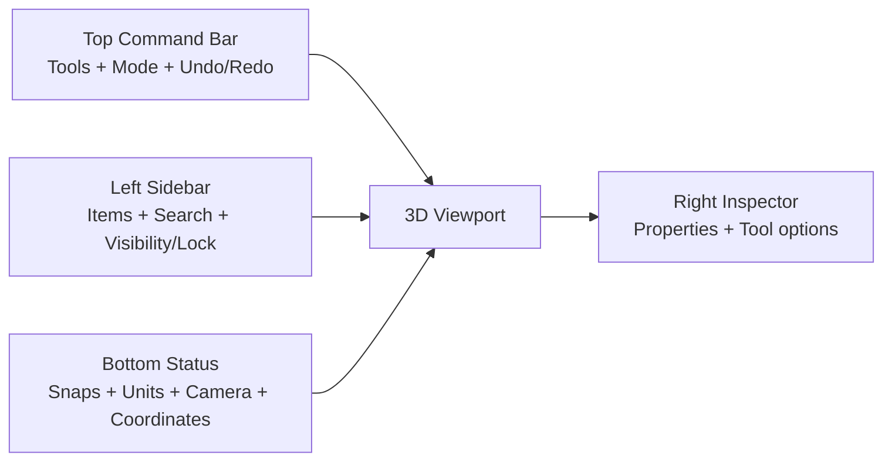

# UI analysis

Below is a “senior UI/UX teardown” of what’s on screen, plus a concrete upgrade plan to make OneCAD look like **premium CAD** (clean, calm, confident).

## North Star Rule

**Premium CAD UI is quiet. Geometry should be the loudest thing on screen, then selection, then tools, then everything else.**

Use this rule as the filter for every visual decision.

---

## 1) Sketch visualization (current)

### What I see

* Sketch is shown as **orange polylines** on the world grid.
* Control points are **small yellow dots**.
* No clear separation between:

  * **active sketch** vs **inactive sketches**
  * **construction** vs **real geometry**
  * **closed regions** vs **open chains**
* Sketch lives visually “inside” the 3D world, but there’s no obvious **sketch plane context**.

### What feels “cheap” right now

* Lines are thin and uniform → reads like debug drawing.
* No region fill / hover feedback → hard to understand what will extrude.
* Points don’t show *editability states* (hover/selected/locked/constrained).

### Make it “expensive”

**Sketch should have a clear visual state machine:**

* **Inactive sketches:** thin, low-contrast gray (barely there).
* **Active sketch:** brighter color + slightly thicker stroke.
* **Selected segment:** accent highlight + subtle glow/outline.
* **Construction geometry:** dashed + dim.
* **Closed profiles:** *soft translucent fill* (very important for “push/pull” UX).

Keep selection accents secondary to geometry per the [North Star rule](#north-star-rule).

**Add “region intelligence” (big premium signal):**

* On hover, show a **tinted face-like fill** for the region under cursor.
* Show tiny “region badges” for multiple loops (optional).

**Point rendering upgrade:**

* Endpoints: small circle.
* Midpoints: optional, only on hover.
* Selected point: larger + ring.
* Constrained point: small constraint glyph next to it (minimal).

**DOF & constraints (when ready):**

* If you show **DOF**, make it contextual:

  * A tiny label near the sketch (“DOF: 3”) not only in status bar.
  * Constraint icons appear only when zoomed in or when sketch is active.

---

## 2) Bodies visualization (current)

### What I see

* Bodies are **flat shaded gray** with strong outline edges.
* Cylinder shows many vertical lines → likely **tessellation edges** leaking through (reads as “mesh”, not “solid CAD”).

### What feels “cheap”

* Everything is the same material + same tone → no depth hierarchy.
* Too many edges on curved surfaces → visual noise.
* Selection/hover states aren’t clearly visible (no face tinting / silhouette emphasis).

### Make it “expensive”

**Default shading needs 3 things:**

1. **Better lighting** (simple, not “photoreal”):

   * Soft key light + subtle fill + faint rim highlight.
2. **Ambient occlusion** (even light SSAO) for contact depth.
3. **Edge policy** that matches CAD:

   * Show only:

     * **silhouette edges**
     * **feature edges** (by crease angle)
   * Hide tessellation edges.

**Selection visuals (must be premium):**

* Hovered face: slight tint + soft border.
* Selected face: stronger tint + crisp outline.
* Selected body: subtle silhouette glow (not neon).

Selection should read as a secondary layer to geometry (see [North Star rule](#north-star-rule)).

**Material strategy:**

* Keep default **neutral gray**, but vary slightly per body (tiny hue shift) to help separation.
* Optional: “Matcap” style option (fast, looks great for CAD).

---

## 3) 3D environment visualization (current)

### What I see

* Dark background, dense grid.
* Axis lines visible (red/green), vertical axis line (blue).
* View cube exists but labels overlap (“FRONTRIGHT” looks cramped).

### What feels “cheap”

* Grid contrast is high → competes with geometry.
* No depth fade → scene feels flat.
* View cube typography/layout is not polished.

### Make it “expensive”

**Grid overhaul:**

* Use **adaptive grid**:

  * Major lines every N units (stronger).
  * Minor lines lighter.
* Fade with distance from origin and with camera zoom.
* Grid should be a *tool*, not a texture.

Keep the grid quiet so geometry remains dominant ([North Star rule](#north-star-rule)).

**Background:**

* Add a subtle **vertical gradient** (slightly brighter near horizon).
* Optional: faint vignette. (Tiny, but makes it feel “cinematic”.)

**Origin marker:**

* Add a small, crisp **origin glyph** (not just axis lines).

**View cube polish:**

* Fix label placement:

  * Only show **one face label** at a time, or keep labels short (“FRONT”, “RIGHT”).
* Add hover highlight on faces/edges.
* Add a small “home” reset.

---

## 4) UI layout (current)

### What I see

* Left sidebar has a simple tree: **Bodies** and **Sketches**.
* Floating vertical tool palette in the viewport (3 buttons).
* Bottom bar has camera mode (Orthographic ↔ Perspective), angle, and XYZ readout.

### What feels “cheap”

* There’s no strong **top-level command area** (toolbar/command bar).
* Floating palette icons are unclear and look “placeholder”.
* Sidebar lacks common CAD affordances (visibility toggles, rename, isolate, filter).

### Make it “expensive”

**Recommended layout (simple + standard for CAD):**



**Sidebar upgrades (high impact):**

* Add per-item icons:

  * Body, sketch, plane, construction.
* Add inline toggles:

  * **👁 visibility**, **🔒 lock**
* Add quick actions:

  * Rename (slow double click)
  * Isolate
  * Color/material (later)
* Add a small **search bar** at top.

**Tool options should live in one predictable place:**

* When user activates a tool (Sketch / Extrude / Move):

  * Show tool settings in **right inspector** or **top bar**, not scattered.

Keep tool chrome intentionally quieter than the model ([North Star rule](#north-star-rule)).

---

## 5) UI element design (current)

### What I see

* Dark theme, rounded panels.
* Selection highlight in sidebar is strong blue.
* Icons look a bit soft / inconsistent in metaphor.

### What feels “cheap”

* Visual hierarchy is not consistent:

  * Some elements look macOS-native, others look custom.
* Icon set doesn’t feel like one family.
* Too many “same-weight” surfaces → no depth/elevation system.

### Make it “expensive”

**Adopt a small design system (tokens):**

* **Surface levels** (important in dark UI):

  * Base background
  * Elevated panels
  * Floating controls (highest)
* **One accent color** (blue is fine) used consistently:

  * selection
  * active tool
  * primary actions
  * keep it restrained so geometry stays dominant ([North Star rule](#north-star-rule))
* **Typography scale**:

  * Sidebar section title (medium/semibold)
  * Item labels (regular)
  * Secondary metadata (smaller/dimmer)
* **Spacing & padding**:
  * Give UI chrome breathing room so geometry stays dominant ([North Star rule](#north-star-rule)).

**Micro-interactions (premium feel):**

* Hover transitions (150–200ms)
* Soft shadow changes on floating panels
* Smooth camera-mode slider animation
* Tooltip on every tool icon (fast learning)

---

# Practical upgrade plan (highest ROI first)

## Phase 1 — “Instant premium” (1–3 days)

* Fix cylinder edge noise: show **silhouette + feature edges only**.
* Reduce grid contrast + add **major/minor** lines + fade.
* Add face hover/selection tinting.
* Polish view cube labels (no overlap).

## Phase 2 — “CAD-grade sketching” (3–7 days)

* Active sketch plane context (plane grid + fade world grid).
* Closed-profile **soft fill** + region hover highlight.
* Sketch line/point states (inactive/active/selected/constraint).

## Phase 3 — “Product-level UI” (1–2 weeks)

* Add top command bar (tool modes + undo/redo).
* Sidebar: visibility/lock, search, context menu.
* Tool settings in right inspector (consistent).

---

# References (UI systems worth borrowing from)

These are good for grounding decisions in proven patterns: ([Apple Developer][1])

```text
Apple HIG – Sidebars: https://developer.apple.com/design/human-interface-guidelines/sidebars
Apple HIG – Toolbars: https://developer.apple.com/design/human-interface-guidelines/toolbars
Material Design – Dark theme: https://m2.material.io/design/color/dark-theme.html
Material 3 – Color system: https://m3.material.io/styles/color/overview
Fluent 2 – Typography: https://fluent2.microsoft.design/typography
Fluent 2 – Iconography: https://fluent2.microsoft.design/iconography
```

[1]: https://developer.apple.com/design/human-interface-guidelines/sidebars?utm_source=chatgpt.com "Sidebars | Apple Developer Documentation"
